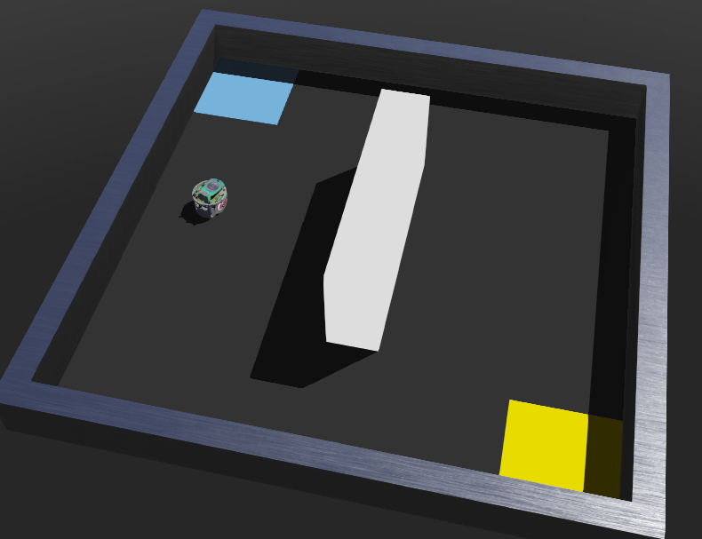
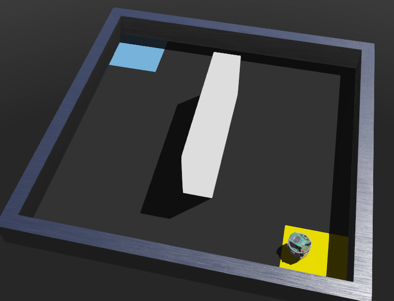

# Q-Learning en Webots

Este proyecto consiste en la simulación de un **robot E-puck** en el entorno **Webots**, capaz de **navegar un laberinto y encontrar una meta** de forma autónoma. Para ello, utiliza **Aprendizaje por Refuerzo (Reinforcement Learning)**, específicamente el algoritmo **Q-Learning**.

El robot utiliza **sensores infrarrojos de distancia (PS)** para detectar obstáculos (definir su _estado_) y **sensores de suelo (GS)** para identificar la zona de meta. El objetivo es que el robot aprenda, a través de prueba y error, una **política óptima (almacenada en una "Tabla Q")** que le indique la mejor _acción_ (avanzar, girar) a tomar en cada _estado_ para maximizar la _recompensa_ total.



## Tecnologías Usadas

- [Webots R2020b revision 1](https://cyberbotics.com/#download)
- C++ (API oficial de Webots)
- Epuck
- Sensores infrarrojos de distancia
- **Q-Learning** (Algoritmo de Aprendizaje por Refuerzo)
- Sensores infrarrojos de distancia (PS) para detección de obstáculos.
- Sensores de suelo (GS) para detección de meta.

---

## Algoritmo de Control Q-Learning (C++)

Q-Learning permite al robot _aprender_ una estrategia óptima. Esto se logra actualizando iterativamente una "Tabla Q" (Q-Table), que es un mapa que almacena el valor futuro esperado para cada par de (estado, acción).

### 1. Fórmulas y Parámetros de Q-Learning

El aprendizaje se basa en la **ecuación de Bellman**, que actualiza el valor Q(s, a) (el valor de tomar la acción a en el estado s) basándose en la recompensa inmediata (r) y el máximo valor Q esperado del _siguiente_ estado (s').

La fórmula de actualización de Q-Learning es:

$$Q(s, a) \leftarrow Q(s, a) + \alpha \left[ r + \gamma \max_{a'} Q(s', a') - Q(s, a) \right]$$

Donde:

- Q(s, a): Es el valor actual estimado por tomar la acción a en el estado s.
- Alpha (Tasa de Aprendizaje): Define qué tan rápido el agente acepta la nueva información (qué tanto "sobrescribe" el valor antiguo).
- r: Es la **recompensa** (Reward) recibida inmediatamente después de tomar la acción a.
- Gamma (Factor de Descuento): Determina la importancia de las recompensas futuras. Un valor cercano a 1 (como 0.9) hace que el agente valore mucho el largo plazo.
- max[{a'},Q(s', a')]: Es la **máxima recompensa futura esperada** que se puede obtener desde el nuevo estado s'.

#### Exploración vs. Explotación (Epsilon-Greedy)

Para que el robot descubra nuevas rutas (exploración) en lugar de solo seguir la mejor ruta conocida (explotación), se usa una variable Épsilon.

- Se genera un número aleatorio. Si es **menor que Épsilon**, el robot toma una **acción aleatoria** (explora).
- Si es **mayor que Épsilon**, toma la **mejor acción** según la Tabla Q (explota).

Épsilon se reduce gradualmente en cada episodio (**Epsilon Decay**), permitiendo al robot explorar mucho al inicio y explotar su conocimiento una vez que ha aprendido.

- `ALPHA` y `GAMMA` son las constantes de la fórmula.
- `epsilon` empieza en `1.0` (100% exploración) y decaerá `0.5%` (`EPSILON_DECAY`) por episodio, hasta un mínimo de `0.01` (1% exploración).
- `Q_TABLE_FILE` y `EPSILON_FILE` guardan el progreso del aprendizaje.
- `NUM_ACTIONS = 3`: Define las acciones posibles (0: Avanzar, 1: Girar Izquierda, 2: Girar Derecha).

```cpp
const double ALPHA = 0.1;
const double GAMMA = 0.9;
double epsilon = 1.0;
const double EPSILON_DECAY = 0.995;
const double EPSILON_MIN = 0.01;

const string Q_TABLE_FILE = "q_table.txt";
const string EPSILON_FILE = "epsilon.txt";
const string LOG_FILE = "q_learning_log.txt";
const string RESULTS_FILE = "results.txt";

const int NUM_ACTIONS = 3;
const int MAX_STEPS_PER_EPISODE = 2000;
```

### 2. Clase `EPuckEnv` (El Entorno)

Esta clase actúa como un intermediario entre Webots y el agente de Q-Learning. Se encarga de manejar los sensores, ejecutar acciones en los motores y definir las reglas del entorno (estados y recompensas).

#### Constructor: `EPuckEnv(int ts)`

Inicializa la conexión con el robot en Webots, obtiene los dispositivos (motores y sensores) y los activa.

- `supervisor = new Supervisor()`: Obtiene el nodo `Supervisor`, necesario para funciones avanzadas como `worldReload()`.
- `getMotor(...)`: Obtiene los punteros a los motores de las ruedas.
- `setPosition(INFINITY)`: Configura los motores en modo de rotación continua (control por velocidad).
- `setVelocity(0.0)`: Asegura que el robot comience detenido.
- `getDistanceSensor(...)` y `enable(TIME_STEP)`: Obtiene los 8 sensores de proximidad (ps) y los 3 de suelo (gs) y los activa para que lean valores cada `TIME_STEP` milisegundos.

```cpp
    EPuckEnv(int ts = 64) : TIME_STEP(ts) {
        supervisor = new Supervisor();
        leftMotor = supervisor->getMotor("left wheel motor");
        rightMotor = supervisor->getMotor("right wheel motor");
        leftMotor->setPosition(INFINITY);
        rightMotor->setPosition(INFINITY);
        leftMotor->setVelocity(0.0);
        rightMotor->setVelocity(0.0);
        for (int i = 0; i < 8; ++i) {
            ps[i] = supervisor->getDistanceSensor(psNames[i]);
            if (ps[i]) ps[i]->enable(TIME_STEP);
        }
        for (int i = 0; i < 3; ++i) {
            gs[i] = supervisor->getDistanceSensor(gsNames[i]);
            if (gs[i]) gs[i]->enable(TIME_STEP);
        }
        supervisor->step(TIME_STEP);
    }
```

#### Función: `getStateKey()`

Esta es una función crucial. Define el **estado** (s) del robot discretizando las lecturas de los sensores de obstáculos.

- Lee los sensores de proximidad (`readPS()`).
- Comprueba 3 direcciones clave:
  - `left (psv[5])`: Sensor lateral izquierdo.
  - `front (psv[0], psv[7])`: Sensores frontales.
  - `right (psv[2])`: Sensor lateral derecho.
- Compara sus lecturas con `DIST_OBSTACLE_THRESHOLD`. Si la lectura es _mayor_, significa que hay un obstáculo cerca.
- `ss << ...`: Convierte esto en un string único (la clave de estado). Por ejemplo:
  - `"0-0-0"`: Sin obstáculos.
  - `"0-1-0"`: Obstáculo al frente.
  - `"1-0-1"`: Obstáculos a izquierda y derecha (un pasillo).

```cpp
    string getStateKey() {
        vector<double> psv = readPS();
        bool left = psv[5] > DIST_OBSTACLE_THRESHOLD;
        bool front = psv[0] > DIST_OBSTACLE_THRESHOLD || psv[7] > DIST_OBSTACLE_THRESHOLD;
        bool right = psv[2] > DIST_OBSTACLE_THRESHOLD;
        std::stringstream ss;
        ss << left << "-" << front << "-" << right;
        return ss.str();
    }
```

#### Función: `applyAction(int action)`

Traduce la **acción** decidida por el agente (un entero 0, 1 o 2) en comandos para los motores.

- `if (action == 0)`: Si la acción es "Avanzar", simplemente asigna `MAX_SPEED` a ambas ruedas y avanza un paso.
- `else`: Si la acción es girar, la lógica es más compleja para asegurar un giro preciso de 90 grados.
- `getField("rotation")`: Obtiene la orientación actual del robot.
- `leftMotor->setVelocity(...)`: Asigna velocidades opuestas para girar en el sitio (`turnSpeed`).
- `const double TARGET = M_PI/2.0`: Define el objetivo del giro (90 grados).
- `while (supervisor->step...)`: Inicia un _sub-bucle_. El robot gira y comprueba su ángulo (`delta`) en cada paso.
- `if (delta >= TARGET - TOL) break;`: Cuando el ángulo girado alcanza los 90 grados (con una tolerancia `TOL`), el bucle se rompe.
- `leftMotor->setVelocity(0.0)`: Detiene el robot después del giro. Esto hace que las acciones "Girar" sean _atómicas_ (el agente no toma otra decisión hasta que el giro de 90 grados se completa).

```cpp
    void applyAction(int action) {
        leftMotor->setPosition(INFINITY);
        rightMotor->setPosition(INFINITY);

        if (action == 0) {
            leftMotor->setVelocity(MAX_SPEED);
            rightMotor->setVelocity(MAX_SPEED);
            supervisor->step(TIME_STEP);
        } else {
            Node *self = supervisor->getSelf();
            Field *rotField = self->getField("rotation");
            const double *rot_before = rotField->getSFRotation();
            double angle_before = rot_before[3];
            double turnSpeed = 0.6 * MAX_SPEED;
            if (action == 1) { leftMotor->setVelocity(-turnSpeed); rightMotor->setVelocity(turnSpeed); }
            else { leftMotor->setVelocity(turnSpeed); rightMotor->setVelocity(-turnSpeed); }
            const double TARGET = M_PI/2.0;
            const double TOL = 0.05;
            int safety = 0;
            while (supervisor->step(TIME_STEP) != -1) {
                const double *rot_now = rotField->getSFRotation();
                double angle_now = normAngle(rot_now[3]);
                double delta = normAngle(angle_now - angle_before);
                if (action == 1) {
                    if (delta >= TARGET - TOL) break;
                } else {
                    if (delta <= -TARGET + TOL) break;
                }
                if (++safety > 200) break;
            }
            leftMotor->setVelocity(0.0);
            rightMotor->setVelocity(0.0);
        }
    }
```

#### Función: `getRewardAndDone(int lastAction, ...)`

Calcula la **recompensa** (r) basándose en el resultado de la acción tomada y determina si el episodio ha terminado.

- `reward = -1`: Asigna un pequeño castigo por cada paso dado. Esto incentiva al robot a encontrar la meta en la menor cantidad de pasos posible.
- `vector<int> floor = readGS()`: Lee los sensores de suelo.
- `bool esEnd = ...`: Comprueba si los 3 sensores de suelo están detectando la zona de meta (cuyos valores están entre `END_MIN` y `END_MAX`).
- `if (esEnd)`: Si el robot llega a la meta, recibe una **recompensa positiva grande** (`+1000`) y el episodio termina (`done = true`).
- `else if (currentState != "0-0-0")`: Comprueba si había un obstáculo (el estado _no_ era "0-0-0", o sea, libre).
- `if (lastAction == 0)`: Si la última acción fue "Avanzar" _mientras_ había un obstáculo (es decir, chocó), recibe un **castigo grande** (`-100`). Esto le enseña a no avanzar contra las paredes.

```cpp
    pair<double,bool> getRewardAndDone(int lastAction, const string& currentState) {
        vector<int> floor = readGS();
        int reward = -1;
        bool done = false;
        bool esEnd = (floor[0] >= END_MIN && floor[0] <= END_MAX) &&
                     (floor[1] >= END_MIN && floor[1] <= END_MAX) &&
                     (floor[2] >= END_MIN && floor[2] <= END_MAX);
        if (esEnd) {
            reward = 1000;
            done = true;
        } else if (currentState != "0-0-0") {
            if (lastAction == 0) {
                reward = -100;
            } else {
                reward = -1;
            }
            done = false;
        }
        return make_pair(reward, done);
    }
```

### 3. Clase `QAgent` (El Agente)

Esta clase implementa la lógica pura de Q-Learning. Mantiene la Tabla Q y decide las acciones y las actualizaciones.

#### Función: `chooseAction(const string &s)`

Implementa la política **Epsilon-Greedy** para decidir si explorar o explotar.

- `ensureState(s)`: (Función auxiliar) Si el estado `s` (ej: "0-1-0") no se ha visto antes, lo añade a la `qtable` con valores por defecto (0.0 para todas las acciones).
- `if (uni(rng) < epsilon_local)`: Genera un número aleatorio (entre 0.0 y 1.0). Si es menor que `epsilon`, decide **explorar**.
- `return actionDist(rng)`: Devuelve una acción aleatoria (0, 1, o 2).
- `else`: Si el número aleatorio es mayor que `epsilon`, decide **explotar**.
- `max_element(vec.begin(), vec.end())`: Busca en la `qtable` la acción (el índice 0, 1 o 2) que tenga el valor Q más alto para el estado actual `s` y la devuelve.

```cpp
    int chooseAction(const string &s) {
        ensureState(s);
        if (uni(rng) < epsilon_local) {
            return actionDist(rng);
        } else {
            auto &vec = qtable[s];
            return (int)(distance(vec.begin(), max_element(vec.begin(), vec.end())));
        }
    }
```

#### Función: `updateQ(const string &s, ...)`

Aquí ocurre el **aprendizaje**. Esta función es la implementación directa de la fórmula de Bellman.

- Recibe el estado antiguo (s), la acción tomada (a), la recompensa obtenida (r), el nuevo estado (s2) y si el episodio terminó (`terminal`).
- `double oldQ = qtable[s][a]`: Obtiene el valor Q antiguo (el Q(s, a) en la fórmula).
- `double maxNext = ...`: Obtiene el \max*{a'} Q(s', a'). Es el mejor valor Q posible desde el \_nuevo* estado `s2`. Si el episodio es `terminal` (llegó a la meta), el valor futuro es 0.
- `double newQ = oldQ + ALPHA * (r + GAMMA * maxNext - oldQ)`: Calcula el nuevo valor Q usando la fórmula completa.
- `qtable[s][a] = newQ`: **Actualiza la Tabla Q** con el nuevo valor aprendido.

```cpp
    void updateQ(const string &s, int a, double r, const string &s2, bool terminal) {
        ensureState(s2);
        double oldQ = qtable[s][a];
        double maxNext = terminal ? 0.0 : *max_element(qtable[s2].begin(), qtable[s2].end());
        double newQ = oldQ + ALPHA * (r + GAMMA * maxNext - oldQ);
        qtable[s][a] = newQ;
    }
```

#### Funciones: `saveQTable()` / `loadQTable()`

Estas funciones permiten la **persistencia**: el robot guarda lo que ha aprendido en un archivo y puede cargarlo en la próxima ejecución.

- `saveQTable`: Recorre el `map` (la `qtable`) y escribe cada par estado-valor (ej: `"0-1-0",-100,-1, -1`) en el archivo `Q_TABLE_FILE`.
- `loadQTable`: hace lo opuesto: lee el archivo al inicio y rellena el `map` para continuar el aprendizaje donde se quedó.

```cpp
    void saveQTable() {
        ofstream f(Q_TABLE_FILE);
        for (auto &p : qtable) {
            f << p.first;
            for (double v : p.second) f << "," << v;
            f << "\n";
        }
        f.close();
    }
    void loadQTable() {
        ifstream f(Q_TABLE_FILE);
        if (!f.is_open()) return;
        string line;
        while (getline(f, line)) {
            if (line.empty()) continue;
            stringstream ss(line);
            string key;
            getline(ss, key, ',');
            vector<double> vals;
            string token;
            while (getline(ss, token, ',')) {
                try { vals.push_back(stod(token)); } catch(...) { vals.push_back(0.0); }
            }
            if ((int)vals.size() < NUM_ACTIONS) vals.resize(NUM_ACTIONS, 0.0);
            qtable[key] = vals;
        }
        f.close();
    }
```

### 4. Bucle Principal de Simulación (`main`)

El `main()` integra todas las piezas. Ejecuta el ciclo de aprendizaje de cada **episodio** (S-A-R-S': Estado, Acción, Recompensa, Siguiente Estado).

- **Paso 1 (S):** `string state = env.getStateKey()`: El robot observa su entorno y define su estado.
- **Paso 2 (A):** `int action = agent.chooseAction(state)`: El agente decide qué hacer (explorar o explotar).
- **Paso 3:** `env.applyAction(action)`: El robot ejecuta la acción en Webots.
- **Paso 4 (R, S'):** `env.getRewardAndDone(...)` y `env.getStateKey()`: El robot recibe su recompensa/castigo (r) y observa su nuevo estado (s').
- **Paso 5 (Aprender):** `agent.updateQ(...)`: El agente actualiza la Tabla Q con esta nueva experiencia.
- **Paso 6 (Fin):** `if (done ...)`: Si el episodio termina (llega a la meta o agota el tiempo):
  - Reduce `epsilon` (Epsilon Decay).
  - Guarda el progreso (`saveQTable`).
  - `env.supervisor->worldReload()`: **Reinicia el mundo** para que el robot comience un nuevo episodio de entrenamiento desde el principio.

```cpp
int main(int argc, char **argv) {
    EPuckEnv env;
    QAgent agent;
    int step_counter = 0;
    double total_reward = 0.0;
    while (env.supervisor->step(env.TIME_STEP) != -1) {
        string state = env.getStateKey();
        vector<int> gs_values = env.readGS();
        int action = agent.chooseAction(state);
        env.applyAction(action);
        step_counter++;
        std::pair<double, bool> result = env.getRewardAndDone(action, state);
        double reward = result.first;
        bool done = result.second;
        string nextState = env.getStateKey();
        total_reward += reward;
        agent.updateQ(state, action, reward, nextState, done);
        if (done || step_counter > MAX_STEPS_PER_EPISODE) {
            agent.epsilon_local = max(EPSILON_MIN, agent.epsilon_local * EPSILON_DECAY);
            agent.saveQTable();
            agent.saveEpsilon();
            env.supervisor->worldReload();
            break;
        }
        state = nextState;
    }
    return 0;
}
```

---

## Resultados

Mediante el entrenamiento a lo largo de múltiples episodios, el robot **aprende exitosamente a navegar el laberinto**.

- **Episodios iniciales (Alto Épsilon):** El robot se mueve de forma errática, explorando el entorno, chocando frecuentemente (recibiendo recompensas de -100) y rara vez encontrando la meta.
- **Episodios intermedios:** El robot comienza a _explotar_ el conocimiento de la Tabla Q, encontrando la meta más a menudo, aunque todavía explora rutas subóptimas.
- **Episodios finales (Bajo Épsilon):** El robot sigue la **política óptima** aprendida. Se mueve directamente desde el inicio hasta la meta, tomando las decisiones correctas en cada intersección (cada _estado_) para maximizar su recompensa y evitar obstáculos.

El resultado es un **agente autónomo** capaz de resolver el laberinto eficientemente, adaptando su comportamiento basado en la experiencia almacenada en la Tabla Q.



## Ejecución del Proyecto en Webots

Para ejecutar este proyecto en **Webots**, sigue estos pasos:

1. **Clona el repositorio** en tu computadora:

   ```bash
   git clone https://github.com/ShinjiMC/webots-q-learn.git
   ```

2. **Abre Webots** y selecciona:

   ```
   File → Open World...
   ```

   Luego, navega hasta la carpeta del proyecto y abre el archivo:

   ```
   worlds/empty.wbt
   ```

3. **Verifica el controlador**:

   - Asegúrate de que el robot tenga asignado el controlador `q-learning` (en C++).
   - Si no, selecciónalo desde el panel izquierdo en **Robot → Controller**.

4. **Ejecuta la simulación**:

   - Haz clic en (Play) o presiona **Ctrl + T** para iniciar.
   - El robot comenzará a seguir la línea negra utilizando el algoritmo PID.

---

## Author

- **Braulio Maldonado Casilla** - [GitHub Profile](https://github.com/ShinjiMC)

## License

This project is licensed under the MIT License. See the [LICENSE](LICENSE) file for details.
