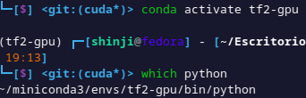
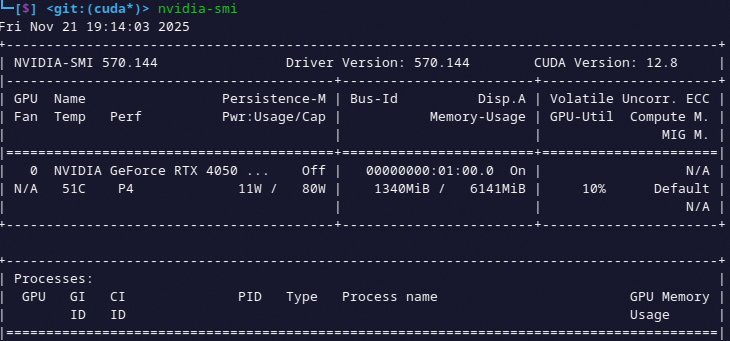
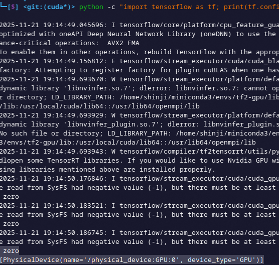
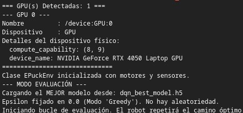

# Deep Q Network + CUDA

Este proyecto consiste en la simulación de un robot E-puck en el entorno Webots, capaz de navegar un laberinto y encontrar una meta de forma autónoma. Para ello, utiliza Aprendizaje por Refuerzo Profundo (Deep Reinforcement Learning), específicamente el algoritmo Deep Q-Network (DQN).

El robot utiliza sensores infrarrojos de distancia (PS) para detectar obstáculos (definir su estado) y sensores de suelo (GS) para identificar la zona de meta. El objetivo es que el robot aprenda, a través de prueba y error, una política óptima (aproximada por una Red Neuronal Profunda) que le indique la mejor acción (avanzar, girar) a tomar en cada estado para maximizar la recompensa total.


## Tecnologías Usadas

- [Webots R2020b revision 1](https://cyberbotics.com/#download)
- Python 3.8
- TensorFlow 2.10 (con soporte GPU)
- Epuck (Robot)
- Sensores infrarrojos de distancia (PS) y de suelo (GS).

---

## Instalación y Configuración (GPU - CUDA)

Para acelerar el entrenamiento utilizando la GPU, es necesario configurar un entorno Conda específico y enlazarlo con Webots mediante el archivo `runtime.ini`.

### 1. Configuración del Entorno Conda

Ejecuta los siguientes comandos en tu terminal para crear el entorno e instalar las dependencias de CUDA y TensorFlow compatibles:

```bash
conda create -n tf2-gpu python=3.8
conda activate tf2-gpu
conda install -c conda-forge cudatoolkit=11.2.2 cudnn=8.1.0
pip install tensorflow==2.10.*
pip install protobuf==3.19.6
```

### 2. Vinculación con Webots (`runtime.ini`)

Webots necesita saber dónde está tu entorno de Python y las librerías de CUDA. Para eso debemos activar el entorno y busca la ruta de tu ejecutable de Python:

```bash
conda activate tf2-gpu
which python
```


(Copia la ruta que te devuelva este comando, por ejemplo: /home/usuario/miniconda3/envs/tf2-gpu/bin/python).

Modifica el archivo `runtime.ini` en la raíz del controlador con el siguiente contenido. Asegúrate de reemplazar las rutas con las que obtuviste en el paso anterior:

```ini
[environment]
LD_LIBRARY_PATH=/home/shinji/miniconda3/envs/tf2-gpu/lib:$LD_LIBRARY_PATH
XLA_FLAGS=--xla_gpu_cuda_data_dir=/home/shinji/miniconda3/envs/tf2-gpu
TF_TRT_ALLOW_ENGINE_NATIVE_SEGMENT_EXECUTION=1
TF_NEED_TENSORRT=0
TF_ENABLE_ONEDNN_OPTS=0

[python]
COMMAND=/home/shinji/miniconda3/envs/tf2-gpu/bin/python
```

### 3. Verificación de GPU

- Para ver que tienes instalado correctamente los drivers para ejecutar con anaconda y trabaje con la tarjeta de video usamos el comando:

```bash
nvidia-smi
```



- Y ejecutamos este para ver si tensorflow se instalo correctamente para que detecte la tarjeta grafica existente:

```bash
python -c "import tensorflow as tf; print(tf.config.list_physical_devices('GPU'))"
```



---

## Deep Q Network - Código - Arquitectura

es un algoritmo que fusiona el Aprendizaje por Refuerzo (Q-Learning) con Redes Neuronales Profundas (Deep Learning).

El Q-Learning tradicional utiliza una "Tabla Q" (una matriz) para almacenar el valor (la recompensa futura esperada) de cada acción en cada estado. Esto funciona bien para problemas simples, pero se vuelve inviable cuando hay muchos estados.

En tu proyecto, el "estado" son los 8 valores de los sensores de proximidad. Como estos valores son continuos (pueden ser 0.1, 0.11, 0.112, etc.), tendrías un número infinito de estados. Es imposible crear una tabla para eso.

DQN resuelve esto usando una Red Neuronal como un "aproximador de funciones". En lugar de almacenar el valor Q, la red aprende a predecir el valor Q para cualquier estado que se le presente.

El algoritmo DQN implementado se basa en dos ideas clave:

### Replay Buffer (Memoria de Repetición)

En lugar de aprender solo de la última experiencia, el agente almacena un historial de sus transiciones (estado, acción, recompensa, estado_siguiente, done).

Para aprender, el agente toma una muestra aleatoria (batch) de esta memoria. Esto es crucial por dos razones:

- **Rompe la correlación**: Las experiencias consecutivas en un robot son muy similares. Aprender de ellas en orden es ineficiente y puede llevar a la red a "olvidar" lo aprendido en estados diferentes. El muestreo aleatorio rompe esta correlación.
- **Eficiencia de datos**: Cada experiencia se reutiliza varias veces para el entrenamiento, lo que permite al agente aprender más de lo que ha vivido.

### Target Network (Red Objetivo)

El aprendizaje en Q-Learning se basa en hacer que el valor Q actual se parezca a un "valor objetivo" (Target Q). El problema es que este "objetivo" también lo calcula la propia red neuronal. Esto es como intentar acertar a un blanco que se mueve constantemente, lo que genera mucha inestabilidad.

DQN resuelve esto usando dos redes neuronales:

- **Modelo Principal**: La red que se entrena activamente en cada paso, se usa para decidir la mejor acción (explotación).

- **Modelo Objetivo**: Es un clon del modelo principal. Esta red se usa solo para calcular el "valor objetivo" y se actualiza de forma lenta.

Esto proporciona un objetivo estable durante el entrenamiento, permitiendo que el modelo principal "alcance" al objetivo antes de que este se mueva.

### Fórmulas

El objetivo del entrenamiento es minimizar el error entre la predicción de la red principal y el "valor objetivo" (Target Q) calculado por la red objetivo.

#### 1. El Valor Q Predicho

Es simplemente la salida de la red principal. Para un estado s y una acción a, la red predice el valor Q.

$$\text{Predicción} = Q_{\text{principal}}(s, a)$$

#### 2. El Valor Q Objetivo (Target Q)

Este es el núcleo del algoritmo y se basa en la Ecuación de Bellman. El "valor objetivo" Y se calcula usando la recompensa r obtenida y el máximo valor Q posible en el siguiente estado s', según la red objetivo.

$$Y = r + \gamma \max_{a'} Q_{\text{objetivo}}(s', a')$$

- Y: El valor Q objetivo (el "Target").
- r: La recompensa inmediata recibida.
- gamma: El factor de descuento. Determina qué tan importantes son las recompensas futuras. Un valor cercano a 1 significa que el agente se preocupa mucho por el futuro.
- \max_Q(s', a'): La red objetivo predice los Q-values para todas las acciones en el siguiente estado s', y tomamos el valor máximo (la mejor acción posible desde s').

Nota: Si el estado s' es terminal, el futuro no importa, por lo que el objetivo es simplemente Y = r.

#### 3. La Función de Pérdida (Loss)

El entrenamiento consiste en minimizar la diferencia entre la predicción y el objetivo. Tu código utiliza la Pérdida de Huber.

$$\text{Loss} = \mathcal{L}(Y - Q_{\text{principal}}(s, a))$$

La Pérdida de Huber es una combinación de:

- **Error Cuadrático Medio (MSE)**: Cuando el error es pequeño, actúa como MSE (error^2), permitiendo un ajuste fino.
- **Error Absoluto Medio (MAE)**: Cuando el error es grande, actúa como MAE (|error|), lo que lo hace menos sensible a recompensas o penalizaciones muy grandes (outliers) y evita "explosiones" en los gradientes.

### Arquitectura

La arquitectura de tu red neuronal se define en la función build_model. Es una red neuronal de tipo "Perceptrón Multicapa" (MLP) totalmente conectada.

#### Capa de Entrada (Input)

- **Forma**: (input_dim,) que es 8.
- **Propósito**: Recibe el "estado" del robot. Cada una de las 8 neuronas de entrada corresponde a uno de los 8 sensores de proximidad (ps0...ps7).

### Capas Ocultas (Hidden Layers)

Capas Ocultas:

- **Dense 512 (ReLU)**: Gran capacidad para extraer características.

- **Dense 512 (ReLU)**: Capa intermedia para abstracción profunda.

- **Dense 256 (ReLU)**: Condensación de características antes de la decisión.

#### Capa de Salida (Output)

- **Neuronas**: 3.
- **Propósito**: Cada neurona de salida corresponde a una de las acciones posibles:
  - Neurona 0: Q-Value para "Avanzar" (acción 0)
  - Neurona 1: Q-Value para "Girar Izquierda" (acción 1)
  - Neurona 2: Q-Value para "Girar Derecha" (acción 2)
- **Activación 'linear'**: Es crucial. A diferencia de la clasificación (que usaría 'softmax'), los valores Q no son probabilidades. Pueden ser cualquier número real (positivo o negativo), ya que representan una recompensa esperada. 'Linear' simplemente significa que no se aplica ninguna activación (y=x).

---

## Deep Q Network - Python

### 1. La Simulación del Robot `environment.py`

Este archivo define la clase `EPuckEnv`, que actúa como un puente entre el controlador de Webots y el agente de Reinforcement Learning. Abstrae las acciones y sensores del robot.

#### `__init__(self, robot, time_step)` (Constructor)

Inicializa la conexión con el robot en Webots, obtiene los dispositivos (motores y sensores) y los activa.

- `self.robot = robot`: Almacena la referencia al objeto `Supervisor` de Webots.
- `self.left_motor = ...` y `self.right_motor = ...`: Obtiene los punteros a los motores de las ruedas.
- `setPosition(float('inf'))`: Configura los motores en modo de rotación continua (control por velocidad).
- `setVelocity(0.0)`: Asegura que el robot comience detenido.
- `getDistanceSensor(...)` y `enable(self.TIME_STEP)`: Obtiene los 8 sensores de proximidad (ps) y los 3 de suelo (gs) y los activa.

```python
    def __init__(self, robot, time_step):
        self.robot = robot
        self.TIME_STEP = time_step
        self.MAX_SPEED = 6.28
        self.END_MIN = 200
        self.END_MAX = 300

        self.left_motor = robot.getMotor('left wheel motor')
        self.right_motor = robot.getMotor('right wheel motor')
        self.left_motor.setPosition(float('inf'))
        self.right_motor.setPosition(float('inf'))
        self.left_motor.setVelocity(0.0)
        self.right_motor.setVelocity(0.0)

        self.ps = []
        ps_names = ['ps0', 'ps1', 'ps2', 'ps3', 'ps4', 'ps5', 'ps6', 'ps7']
        for name in ps_names:
            sensor = robot.getDistanceSensor(name)
            sensor.enable(self.TIME_STEP)
            self.ps.append(sensor)

        self.gs = []
        gs_names = ['gs0', 'gs1', 'gs2']
        for name in gs_names:
            sensor = robot.getDistanceSensor(name)
            sensor.enable(self.TIME_STEP)
            self.gs.append(sensor)
        print("Clase EPuckEnv inicializada con motores y sensores.")
```

#### `get_state(self)`

Define el "estado" del robot, que es la entrada para la red neuronal.

- `ps_values = [s.getValue() for s in self.ps]`: Lee los 8 valores de los sensores de proximidad.
- `state = np.array(ps_values) / 1000.0`: Convierte los valores a un array y los normaliza (divide por 1000.0) para que la red neuronal trabaje con números más pequeños.

```python
    def get_state(self):
        ps_values = [s.getValue() for s in self.ps]
        state = np.array(ps_values) / 1000.0
        return state
```

#### `apply_action(self, action)`

Traduce una acción discreta (0, 1, o 2) en velocidades para los motores.

- `action == 0`: **Avanzar**. Ambos motores van a máxima velocidad.
- `action == 1`: **Girar Izquierda**. El motor izquierdo va hacia atrás y el derecho hacia adelante.
- `action == 2`: **Girar Derecha**. El motor izquierdo va hacia adelante y el derecho hacia atrás.

```python
    def apply_action(self, action):
        turn_speed = self.MAX_SPEED * 0.8
        if action == 0:
            left_speed = self.MAX_SPEED
            right_speed = self.MAX_SPEED
        elif action == 1:
            left_speed = -turn_speed
            right_speed = turn_speed
        else:
            left_speed = turn_speed
            right_speed = -turn_speed
        self.left_motor.setVelocity(left_speed)
        self.right_motor.setVelocity(right_speed)
```

#### `get_reward_and_done(self, action, state_values)`

Calcula la recompensa por la acción tomada y determina si el episodio ha terminado.

- `floor_values = [s.getValue() for s in self.gs]`: Lee los sensores de suelo.
- `if (self.END_MIN <= ...)`: Comprueba si los 3 sensores de suelo están sobre la zona de meta. Si es así, da una **recompensa alta (1.0)** y termina el episodio (`done = True`).
- `front_obstacle = ...`: Comprueba si los sensores frontales (ps0 y ps7) detectan un obstáculo. Si es así, da una **penalización alta (-1.0)**.
- `elif action == 0`: Si no choca y la acción fue "avanzar", da una **pequeña recompensa (0.1)** para incentivar el movimiento.
- `else`: Si la acción fue "girar" (y no hay choque/meta), da una **pequeña penalización (-0.1)** para desincentivar giros innecesarios.

```python
    def get_reward_and_done(self, action, state_values):
        reward = 0.0
        done = False
        floor_values = [s.getValue() for s in self.gs]

        if (self.END_MIN <= floor_values[0] <= self.END_MAX and
            self.END_MIN <= floor_values[1] <= self.END_MAX and
            self.END_MIN <= floor_values[2] <= self.END_MAX):
            reward = 1.0
            done = True
        else:
            front_obstacle_threshold = 0.1
            front_obstacle = (state_values[0] > front_obstacle_threshold or
                              state_values[7] > front_obstacle_threshold)
            if front_obstacle:
                reward = -1.0
            elif action == 0:
                reward = 0.1
            else:
                reward = -0.1
        return reward, done
```

---

### 2. El Cerebro DQN `agent.py`

Este archivo define al agente de DQN. Contiene la arquitectura de la red neuronal, el buffer de repetición y la lógica de aprendizaje, la cual ha sido optimizada para ejecutarse eficientemente en GPU (CUDA).

Al inicio del archivo, se incluye un bloque de código que detecta las GPUs disponibles y configura `memory_growth`. Esto es crucial para evitar que TensorFlow reserve toda la VRAM de golpe, permitiendo una gestión más eficiente de los recursos gráficos.

#### Configuración y Detección de GPU

Antes de definir cualquier clase o función, el script ejecuta este bloque de configuración crítica para gestionar cómo TensorFlow interactúa con el hardware.

```python
gpus = tf.config.list_physical_devices('GPU')
if gpus:
    try:
        for gpu in gpus:
            tf.config.experimental.set_memory_growth(gpu, True)

        print(f"\n=== GPU(s) Detectadas: {len(gpus)} ===")

        logical_gpus = tf.config.list_logical_devices('GPU')

        for i, gpu in enumerate(logical_gpus):
            print(f"\n--- GPU {i} ---")
            print(f"Nombre         : {gpu.name}")
            print(f"Dispositivo    : {gpu.device_type}")
        for i, gpu in enumerate(gpus):
            details = tf.config.experimental.get_device_details(gpu)
            print("\nDetalles del dispositivo físico:")
            for key, value in details.items():
                print(f"  {key}: {value}")
        print("\n==============================\n")
    except RuntimeError as e:
        print(e)
else:
    print("No se detectó GPU. Se usará la CPU.")
```

1. **Gestión de Memoria VRAM (`set_memory_growth`)** Por defecto, TensorFlow intenta reservar la totalidad de la memoria de vídeo (VRAM) de la GPU tan pronto como se inicia. Esto suele causar errores de "Out of Memory" (OOM) si el sistema operativo o Webots están usando parte de la tarjeta gráfica.

   - `tf.config.experimental.set_memory_growth(gpu, True)`: Cambia este comportamiento. Indica a TensorFlow que empiece asignando poca memoria y crezca dinámicamente (solicite más memoria) solo a medida que la red neuronal lo necesite. Esto evita bloqueos y conflictos con otras aplicaciones.

2. **Diagnóstico de Hardware**: El bloque incluye impresiones detalladas para confirmar que la configuración de CUDA fue exitosa. Si ves estos mensajes en la consola, significa que los drivers y las librerías `cudatoolkit/cudnn` están correctamente enlazados:

- **Detección**: `tf.config.list_physical_devices('GPU')` lista las tarjetas físicas disponibles.
- **Detalles**: Imprime el nombre de la tarjeta (ej. "NVIDIA GeForce RTX 3060") y su tipo, confirmando que el entorno `conda` está funcionando.

#### `build_model(input_dim, output_dim)` (Función Helper)

Define la arquitectura de la Red Neuronal Profunda (DQN) usando Keras.

- `input_dim`: Dimensión del estado (8, por los 8 sensores).
- `output_dim`: Dimensión de la acción (3, por Avanzar, Izquierda, Derecha).
- `layers.Dense(512, ...)`, `layers.Dense(512, ...)` y `layers.Dense(256, ...)`: Capas ocultas con activación ReLU.
- `layers.Dense(output_dim, activation='linear')`: Capa de salida. Produce 3 valores Q (uno por acción) sin activación (lineal), ya que los valores Q no están acotados.
- `model.compile(...)`: Configura el optimizador `Adam` y la función de pérdida `huber`, que es robusta frente a errores grandes. Con un `learning_rate` de 0.00025.

```python
def build_model(input_dim, output_dim):
    model = keras.Sequential([
        layers.Dense(512, activation='relu', input_shape=(input_dim,)),
        layers.Dense(512, activation='relu'),
        layers.Dense(256, activation='relu'),
        layers.Dense(output_dim, activation='linear')
    ])
    model.compile(optimizer=keras.optimizers.Adam(learning_rate=0.00025, clipvalue=1.0), loss='huber')
    return model
```

#### `train_step(model, states, targets, actions)` (Optimización CUDA)

Utiliza el decorador `@tf.function`, lo que instruye a TensorFlow para compilar esta función en un **Grafo Computacional Estático**.

- En lugar de ejecutar operaciones de Python una por una, TensorFlow optimiza todo el bloque de cálculo y lo ejecuta directamente en la GPU (CUDA). Esto reduce drásticamente el tiempo de entrenamiento por paso.

```python
@tf.function
def train_step(model, states, targets, actions):
    with tf.GradientTape() as tape:
        q_values = model(states, training=True)
        indices = tf.stack([tf.range(tf.shape(actions)[0]), actions], axis=1)
        chosen_q = tf.gather_nd(q_values, indices)
        loss = tf.keras.losses.Huber()(targets, chosen_q)

    grads = tape.gradient(loss, model.trainable_variables)
    model.optimizer.apply_gradients(zip(grads, model.trainable_variables))
    return loss
```

**Lógica:**

1. Realiza una pasada hacia adelante (`model(states)`) para obtener los valores Q.
2. Usa `tf.gather_nd` para seleccionar solo los valores Q de las acciones que el agente realmente tomó.
3. Calcula la pérdida (Huber Loss) y los gradientes (`tape.gradient`).
4. Aplica los gradientes para actualizar los pesos de la red.

#### `ReplayBuffer` (Clase)

Almacena las experiencias pasadas `(estado, acción, recompensa, estado_siguiente, done)` para que el agente pueda aprender de ellas en lotes aleatorios.

- `self.buffer = deque(maxlen=...)`: Usa una `deque` (cola de doble extremo) que descarta automáticamente las experiencias más antiguas cuando se llena.
- `add(...)`: Añade una nueva experiencia al buffer.
- `sample(...)`: Extrae un lote (`batch_size`) de experiencias aleatorias del buffer.

```python
class ReplayBuffer:
    def __init__(self, max_size=20000):
        self.buffer = deque(maxlen=max_size)

    def add(self, state, action, reward, next_state, done):
        self.buffer.append((state, action, reward, next_state, done))

    def sample(self, batch_size):
        return random.sample(self.buffer, batch_size)

    def __len__(self):
        return len(self.buffer)
```

#### `DQNAgent.__init__(self, state_dim, action_dim)` (Constructor)

Inicializa el agente, sus hiperparámetros y sus dos redes neuronales (la principal y la "target").

- `self.gamma`: Factor de descuento (qué tanto importan las recompensas futuras).
- `self.epsilon`: Tasa de exploración (probabilidad de tomar una acción aleatoria).
- `self.epsilon_decay` y `self.epsilon_min`: Controlan cómo `epsilon` disminuye con el tiempo.
- `self.buffer = ReplayBuffer()`: Crea la memoria del agente.
- `self.model = build_model(...)`: Crea la red neuronal principal (la que aprende).
- `self.target_model = build_model(...)`: Crea la red "objetivo" (target network), una copia que se actualiza lentamente para estabilizar el aprendizaje.
- `self.update_target_model()`: Sincroniza ambas redes al inicio.

```python
class DQNAgent:
    def __init__(self, state_dim, action_dim):
        self.state_dim = state_dim
        self.action_dim = action_dim
        self.gamma = 0.95
        self.epsilon = 1.0
        self.epsilon_decay = 0.995
        self.epsilon_min = 0.01
        self.batch_size = 256
        self.buffer = ReplayBuffer()
        self.model = build_model(state_dim, action_dim)
        self.target_model = build_model(state_dim, action_dim)
        self.update_target_model()
        self.model_weights_file = 'dqn_model_weights.h5'
        self.epsilon_file = 'dqn_epsilon.npy'
        self.buffer_file = 'dqn_buffer.pkl'
```

#### `choose_action(self, state)`

Decide qué acción tomar usando la política "Epsilon-Greedy".

- `if np.random.rand() < self.epsilon`: Si un número aleatorio es menor que epsilon, elige una **acción aleatoria** (exploración).
- `else`: Si no, usa la red neuronal (`self.model`) para predecir los valores Q para el estado actual y elige la **mejor acción** (la que tiene el valor Q más alto, `np.argmax`).

```python
    def choose_action(self, state):
        if np.random.rand() < self.epsilon:
            return random.randrange(self.action_dim)
        state_tensor = state[np.newaxis, :]
        q_values = self.model.predict(state_tensor, verbose=0)
        return np.argmax(q_values[0])
```

#### `learn(self)`

El núcleo del aprendizaje ha sido reescrito para aprovechar la aceleración por GPU mediante operaciones vectorizadas y grafos estáticos.

1.  `if len(self.buffer) < self.batch_size`: Verifica si hay suficientes experiencias para entrenar; si no, retorna.
2.  `batch = self.buffer.sample(...)`: Obtiene un lote aleatorio de experiencias `(estado, acción, recompensa,...)` para romper la correlación temporal.
3.  **Conversión a Tensores (`tf.convert_to_tensor`)**: Este es un paso crucial para el rendimiento. Convierte las listas de Python (CPU) en **Tensores de TensorFlow** (GPU).
    - `states`, `rewards`, etc., se transforman a `tf.float32` o `tf.int32`. Esto mueve los datos a la memoria de la tarjeta gráfica para su procesamiento paralelo.
4.  `q_next = self.target_model(next_states, training=False)`: Obtiene los Q-values del siguiente estado.
    - **Nota:** Se llama al modelo directamente `self.target_model(...)` en lugar de usar `.predict()`. Esto evita la sobrecarga (overhead) de Keras y es mucho más rápido dentro de un bucle de entrenamiento personalizado.
5.  `targets = rewards + ...`: Calcula el "Valor Objetivo" usando la **Ecuación de Bellman**.
    - Utiliza operaciones vectorizadas de TensorFlow (`tf.reduce_max`, suma y multiplicación de tensores) para calcular el objetivo de los 256 ejemplos del lote simultáneamente.
6.  `loss = train_step(self.model, states, targets, actions)`: **Optimización Compilada**.
    - En lugar de usar el lento método `.fit()`, se invoca la función personalizada `train_step` (decorada con `@tf.function`). Esta función ejecuta el cálculo de la pérdida, la derivación de gradientes y la actualización de pesos todo en un único paso optimizado en la GPU.

```python
    def learn(self):
        if len(self.buffer) < self.batch_size:
            return None
        batch = self.buffer.sample(self.batch_size)
        states, actions, rewards, next_states, dones = zip(*batch)
        states = tf.convert_to_tensor(states, dtype=tf.float32)
        next_states = tf.convert_to_tensor(next_states, dtype=tf.float32)
        rewards = tf.convert_to_tensor(rewards, dtype=tf.float32)
        actions = tf.convert_to_tensor(actions, dtype=tf.int32)
        dones = tf.convert_to_tensor(dones, dtype=tf.float32)
        q_next = self.target_model(next_states, training=False)
        q_next_max = tf.reduce_max(q_next, axis=1)
        targets = rewards + self.gamma * q_next_max * (1.0 - dones)
        loss = train_step(self.model, states, targets, actions)
        return float(loss)
```

#### `save_state(self)` y `load_state(self)`

Funciones para guardar y cargar el progreso del entrenamiento.

- Guardan/cargan los pesos de la red (`.h5`), el valor actual de epsilon (`.npy`) y el buffer de repetición (`.pkl`), permitiendo reanudar el entrenamiento.

```python
    def save_state(self):
        print(f"Guardando estado... Epsilon actual: {self.epsilon}")
        self.model.save_weights(self.model_weights_file)
        np.save(self.epsilon_file, [self.epsilon])
        try:
            with open(self.buffer_file, 'wb') as f:
                pickle.dump(self.buffer, f)
            print(f"Buffer guardado (Tamaño: {len(self.buffer)})")
        except Exception as e:
            print(f"Error al guardar el buffer: {e}")

    def load_state(self):
        if os.path.exists(self.model_weights_file):
            print("Cargando estado guardado...")
            self.model.load_weights(self.model_weights_file)
            self.epsilon = np.load(self.epsilon_file)[0]
            print(f"Estado cargado. Epsilon reanudado en: {self.epsilon}")
            self.update_target_model()
        else:
            print("No se encontró estado guardado. Empezando de cero.")
        if os.path.exists(self.buffer_file):
            try:
                with open(self.buffer_file, 'rb') as f:
                    self.buffer = pickle.load(f)
                print(f"Buffer cargado (Tamaño: {len(self.buffer)})")
            except Exception as e:
                print(f"Error al cargar el buffer: {e}")
```

---

### 3. El Controlador de Entrenamiento `dqn.py`

Este es el script principal que se ejecuta en Webots para entrenar al agente.

#### Inicialización y Carga de "Mejor Modelo"

Configura el entorno y el agente. Además, intenta cargar las métricas del mejor modelo previo. El código es robusto: verifica si el archivo de métricas tiene el formato nuevo (3 valores: tiempo, recompensa, loss) o el antiguo (2 valores), y maneja casos de corrupción reiniciando los contadores.

- `supervisor = Supervisor()`: Obtiene el controlador de Webots.

- `env = EPuckEnv(...)` y `agent = DQNAgent(...)`: Crea los objetos del entorno y el agente.

- `if os.path.exists(BEST_METRICS_FILE)`: ...: Carga el récord histórico. Si el archivo existe, extrae `BEST_TIME`, `BEST_REWARD` y `BEST_AVG_LOSS`.

```python
supervisor = Supervisor()
TIME_STEP = 64
MAX_STEPS_PER_EPISODE = 1000
UPDATE_TARGET_EVERY = 100
STATE_DIM = 8
ACTION_DIM = 3

env = EPuckEnv(supervisor, TIME_STEP)
agent = DQNAgent(STATE_DIM, ACTION_DIM)

BEST_MODEL_FILE = 'dqn_best_model.h5'
BEST_METRICS_FILE = 'dqn_best_metrics.npy'

if os.path.exists(BEST_METRICS_FILE):
    print("Cargando métricas del mejor modelo...")
    metrics = np.load(BEST_METRICS_FILE)
    if len(metrics) == 3:
        BEST_TIME = metrics[0]
        BEST_REWARD = metrics[1]
        BEST_AVG_LOSS = metrics[2]
    elif len(metrics) == 2:
        print("Detectado archivo de métricas antiguo (2 valores). Actualizando a 3.")
        BEST_TIME = np.inf
        BEST_REWARD = metrics[0]
        BEST_AVG_LOSS = metrics[1]
    else:
        print("Error: Archivo de métricas corrupto. Empezando de cero.")
        BEST_TIME = np.inf
        BEST_REWARD = -np.inf
        BEST_AVG_LOSS = np.inf
    print(f"Mejor Tiempo cargado: {BEST_TIME:.2f} segundos")
    print(f"Mejor Recompensa cargada: {BEST_REWARD:.2f}")
else:
    print("No se encontraron métricas. Empezando 'Mejor Modelo' de cero.")
    BEST_TIME = np.inf
    BEST_REWARD = -np.inf
    BEST_AVG_LOSS = np.inf
```

#### Bucle Principal de Simulación (`while supervisor.step(...) != -1:`)

Este es el bucle que se ejecuta en cada paso de la simulación.

- `action = agent.choose_action(state)`: Elige una acción (Exploración o Explotación).
- `env.apply_action(action)`: Ejecuta la acción en el robot.
- `loss = agent.learn()`: Ejecuta un paso de aprendizaje y guarda la pérdida en episode_losses.
- **Monitoreo**: Cada 20 pasos, imprime en consola la recompensa acumulada y el loss actual para seguimiento en tiempo real.
- `agent.update_target_model()`: Cada `UPDATE_TARGET_EVERY` pasos, actualiza la red "target".

```python

agent.load_state()
print(f"--- Iniciando Episodio (Epsilon actual: {agent.epsilon:.3f}) ---")
print(f"--- Tamaño del Buffer: {len(agent.buffer)} ---")
start_time = time.time()
supervisor.step(TIME_STEP)
state = env.get_state()
total_reward = 0
step_counter = 0
episode_losses = []

while supervisor.step(TIME_STEP) != -1:
    action = agent.choose_action(state)
    env.apply_action(action)
    next_state = env.get_state()
    reward, done = env.get_reward_and_done(action, state)
    total_reward += reward
    agent.store_transition(state, action, reward, next_state, done)
    loss = agent.learn()
    if loss is not None:
        episode_losses.append(loss)
        if step_counter % 20 == 0:
            print(f"Paso {step_counter}, Recompensa: {total_reward:.2f}, Loss actual: {loss:.4f}")
    state = next_state
    step_counter += 1
    if step_counter % UPDATE_TARGET_EVERY == 0:
        agent.update_target_model()
    if done or step_counter > MAX_STEPS_PER_EPISODE:
```

#### Fin del Episodio (Logging y Guardado)

Esta sección se ejecuta cuando el robot llega a la meta (`done=True`) o se acaba el tiempo (`MAX_STEPS_PER_EPISODE`).

- **Cálculo de Tiempo**: Calcula la duración exacta del episodio (`duration_sec`) y la formatea para los logs.
- **Logs**: Escribe el resultado (Meta/Fracaso), recompensa y duración en los archivos de texto (`LOG_FILE` y `METRICS_LOG_FILE`).
- **Lógica del "Mejor Modelo":**
  - El criterio principal ahora es la Velocidad.
  - Comprueba si el robot llegó a la meta (`reason == "Meta"`) y si el tiempo fue menor al récord anterior (`duration_sec < BEST_TIME`).
  - Si es un nuevo récord, guarda los pesos del modelo y actualiza el archivo `.npy` con el nuevo mejor tiempo, recompensa y pérdida.
- **Reinicio:** Si no se ha alcanzado el epsilon mínimo, recarga el mundo (`supervisor.worldReload()`) para el siguiente episodio.

```python
    if done or step_counter > MAX_STEPS_PER_EPISODE:
        end_time = time.time()
        duration_sec = end_time - start_time

        if done:
            print(f"¡META ALCANZADA! Pasos: {step_counter}, Recompensa Final: {total_reward:.2f}")
        else:
            print(f"¡TIEMPO LÍMITE! Pasos: {step_counter}, Recompensa Final: {total_reward:.2f}")

        agent.decay_epsilon()
        agent.save_state()

        if reason == "Meta" and duration_sec < BEST_TIME:
            print("\n--- ¡NUEVO RÉCORD DE VELOCIDAD! ---")
            print(f"Tiempo: {duration_sec:.2f}s (Récord anterior: {BEST_TIME:.2f}s)")

            BEST_TIME = duration_sec
            BEST_REWARD = total_reward
            BEST_AVG_LOSS = avg_loss

            agent.model.save_weights(BEST_MODEL_FILE)
            metrics_to_save = np.array([BEST_TIME, BEST_REWARD, BEST_AVG_LOSS])
            np.save(BEST_METRICS_FILE, metrics_to_save)
            print("Métricas actualizadas.\n")
        else:
            print("Info: No es un nuevo récord.")

        if agent.epsilon <= agent.epsilon_min:
            print("--- ENTRENAMIENTO COMPLETADO ---")
            break
        else:
            print("--- Reiniciando para el próximo episodio... ---")
            supervisor.worldReload()
            supervisor.step(TIME_STEP)
```

---

### 4. El Controlador de Evaluación `eval.py`

Este script se usa _después_ del entrenamiento para ver al agente en acción. Carga el **mejor modelo** guardado y lo ejecuta sin exploración.

#### Inicialización y Carga del Mejor Modelo

Configura el entorno y el agente, pero en lugar de cargar el último estado, carga el `dqn_best_model.h5`.

- `if os.path.exists(BEST_MODEL_FILE): ...`: Comprueba que el modelo entrenado exista.
- `agent.model.load_weights(BEST_MODEL_FILE)`: Carga los pesos del mejor modelo encontrado durante el entrenamiento.
- `agent.epsilon = 0.0`: **¡Muy importante\!** Fija epsilon a 0.0. Esto desactiva la exploración (acciones aleatorias). El agente siempre elegirá la mejor acción que conoce (modo "Greedy").

```python
TIME_STEP = 64
MAX_STEPS_PER_EPISODE = 1000
STATE_DIM = 8
ACTION_DIM = 3

BEST_MODEL_FILE = 'dqn_best_model.h5'

supervisor = Supervisor()
env = EPuckEnv(supervisor, TIME_STEP)
agent = DQNAgent(STATE_DIM, ACTION_DIM)

if os.path.exists(BEST_MODEL_FILE):
    print("--- MODO EVALUACIÓN ---")
    print(f"Cargando el MEJOR modelo desde: {BEST_MODEL_FILE}")
    agent.model.load_weights(BEST_MODEL_FILE)
    agent.epsilon = 0.0
    print("Epsilon fijado en 0.0 (Modo 'Greedy'). No hay aleatoriedad.")
else:
    print(f"Error: No se encontró el archivo del mejor modelo: {BEST_MODEL_FILE}")
    sys.exit()
```

#### Bucle de Evaluación y Reinicio

Ejecuta la simulación de forma similar al entrenamiento, pero con diferencias clave.

- `action = agent.choose_action(state)`: Siempre elegirá la mejor acción (epsilon=0).
- **No hay aprendizaje**: Faltan las llamadas a `agent.store_transition()`, `agent.learn()` y `agent.decay_epsilon()`. El agente solo actúa, no aprende.
- `if done or step_counter > ...`: Cuando el episodio termina (llega a la meta o falla), imprime el resultado.
- `supervisor.worldReload()`: Reinicia el mundo inmediatamente para repetir la demostración óptima.

```python
supervisor.step(TIME_STEP)
state = env.get_state()
total_reward = 0
step_counter = 0
while supervisor.step(TIME_STEP) != -1:
    action = agent.choose_action(state)
    env.apply_action(action)
    next_state = env.get_state()
    reward, done = env.get_reward_and_done(action, state)
    total_reward += reward
    state = next_state
    step_counter += 1

    if done or step_counter > MAX_STEPS_PER_EPISODE:
        if done:
            print(f"¡META ALCANZADA! Pasos: {step_counter}, Recompensa Final: {total_reward:.2f}")
        else:
             print(f"¡TIEMPO LÍMITE! Pasos: {step_counter}, Recompensa Final: {total_reward:.2f}")

        print("--- Reiniciando mundo para repetir la demostración ---")
        supervisor.worldReload()
        supervisor.step(TIME_STEP)
        state = env.get_state()
        total_reward = 0
        step_counter = 0
```

---

## Resultados

El entrenamiento actual, que abarca 160 episodios, muestra una clara transición desde el desconocimiento total hasta la consecución de las primeras políticas exitosas. A diferencia del ejemplo anterior, este agente ha logrado éxitos significativos (como recompensas positivas) en una etapa más temprana del entrenamiento (Episodio 144), aunque todavía se encuentra en una fase activa de aprendizaje con un Epsilon medio (~0.45).

### 1. Fase de Exploración y Fracaso (Episodios ~1–49)

- **Comportamiento:** Con Epsilon iniciando en 1.0 y descendiendo lentamente, el agente actuó de manera aleatoria.
- **Resultados:** Todos los episodios en esta fase resultaron en Fracaso, agotando el tiempo límite (1001 pasos). Las recompensas fueron consistentemente negativas (ej. -696.80, -922.00), indicando que el robot no encontraba la meta y sufría penalizaciones constantes.
- **Pérdida (_Loss_):** El error de la red comenzó muy bajo (0.019) y aumentó progresivamente a medida que el agente comenzaba a descubrir que sus acciones aleatorias tenían consecuencias negativas.

### 2. Fase de Descubrimiento (Episodios 50–140)

- **El Primer Éxito:** En el **Episodio 50** (Epsilon = 0.7822), se produjo un punto de inflexión: el agente encontró la **Meta** por primera vez tras 687 pasos. Aunque la recompensa fue negativa (-620.50), este evento marcó el inicio del aprendizaje real.
- **Inestabilidad:** A partir de aquí, el agente comenzó a alternar entre éxitos esporádicos y fracasos. En el **Episodio 82**, logró llegar a la meta en solo **353 pasos** (el tiempo más rápido registrado hasta el momento), aunque la recompensa seguía siendo negativa (-115.80) debido a colisiones o movimientos ineficientes.

### 3. Fase de Refinamiento y Recompensa Positiva (Episodios 140–160)

- **Comportamiento:** Con Epsilon rondando el valor de 0.48, el agente comenzó a explotar mejor su conocimiento.
- **Hito Principal:** En el **Episodio 144**, el agente logró su **primera recompensa positiva (16.70)**. Esto es crucial, ya que indica que encontró un camino hacia la meta lo suficientemente limpio y rápido como para superar las penalizaciones acumuladas.
- **Estado Actual:** El entrenamiento finalizó en el episodio 160. Aunque todavía hay variabilidad, la tendencia muestra que el agente es capaz de replicar el éxito con mayor frecuencia.

| Episodio | Epsilon | Pasos | Resultado | Recompensa Total | Hito Significativo                         |
| -------- | ------- | ----- | --------- | ---------------- | ------------------------------------------ |
| 1        | 1.0000  | 1001  | Fracaso   | -289.00          | Inicio del entrenamiento                   |
| 50       | 0.7822  | 687   | Meta      | -620.50          | Primera vez que alcanza la Meta            |
| 82       | 0.6663  | 353   | Meta      | -115.80          | Episodio más rápido (menor n° pasos)       |
| 144      | 0.4883  | 408   | Meta      | 16.70            | Primera Recompensa Positiva / Mejor Récord |
| 160      | 0.4507  | 796   | Meta      | -193.60          | Último episodio registrado                 |

### Gráficos

1. **Recompensa total por episodio**
   La gráfica muestra cómo el agente sale de la zona de "recompensas profundas" (cerca de -900) para estabilizarse alrededor de -200/-400, logrando finalmente romper la barrera del cero en el episodio 144.

   

2. **Pérdida (_Loss_) promedio por episodio**
   La pérdida muestra el comportamiento clásico de aprendizaje: un aumento inicial mientras el agente descubre la complejidad del entorno, seguido de oscilaciones mientras ajusta su política (Q-values) para maximizar la recompensa futura.

   

## Ejecución del Proyecto en Webots

Para ejecutar este proyecto en **Webots**, sigue estos pasos:

1. **Clona el repositorio** en tu computadora:

   ```bash
   git clone https://github.com/ShinjiMC/webots-deep-q-network.git
   cd webots-deep-q-network
   git checkout cuda
   ```

2. **Abre Webots** y selecciona:

   ```
   File → Open World...
   ```

   Luego, navega hasta la carpeta del proyecto y abre el archivo:

   ```
   worlds/empty.wbt
   ```

3. **Verifica el controlador**:

   - Asegúrate de que el robot tenga asignado el controlador `dqn` (en Python).
   - Si no, selecciónalo desde el panel izquierdo en **Robot → Controller**.

4. **Ejecuta el entrenamiento**:

   - Haz clic en el botón **Play** o presiona **Ctrl + T** para iniciar la simulación.
   - El robot comenzará a entrenar el modelo desde cero, generando el archivo de pesos entrenados en formato `.h5`.

5. **Evaluar el modelo entrenado**

   Para evaluar el modelo entrenado y observar el comportamiento final del agente:

   - Cambia el nombre del archivo `dqn.py` a `dqn_2.py` (esto evita conflictos con el nuevo script de evaluación).
   - Verifica el nombre exacto del archivo `.h5` generado durante el entrenamiento (por ejemplo, `model_dqn_final.h5`).
   - Abre el archivo `eval.py`, reemplaza el nombre del modelo en el código por el nombre correcto del archivo `.h5`, y cambia el nombre del script de `eval.py` a `dqn.py`.
   - Finalmente, ejecuta nuevamente la simulación. El robot utilizará el modelo entrenado y llegará consistentemente a la meta sin requerir aprendizaje adicional.




---

## Author

- **Braulio Maldonado Casilla** - [GitHub Profile](https://github.com/ShinjiMC)

## License

This project is licensed under the MIT License. See the [LICENSE](LICENSE) file for details.
