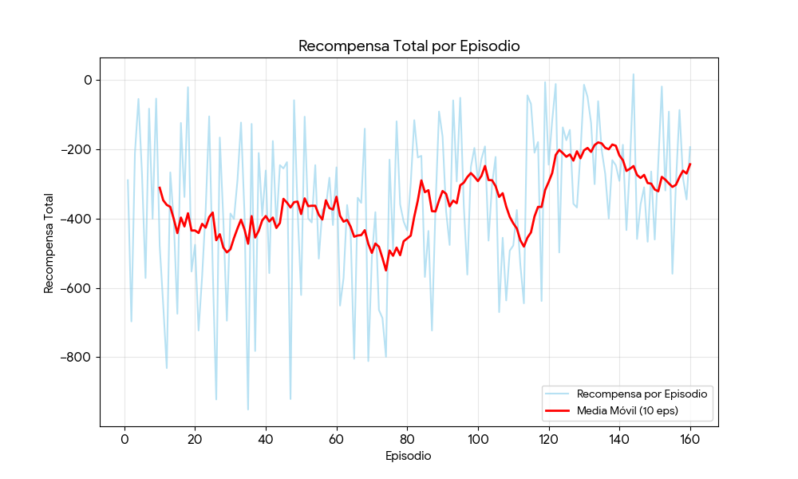
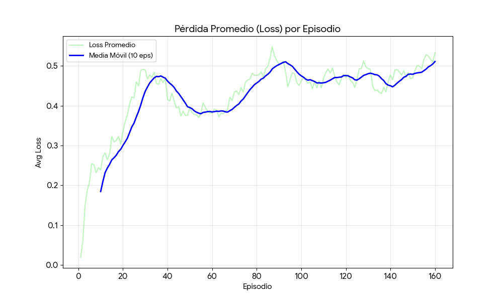
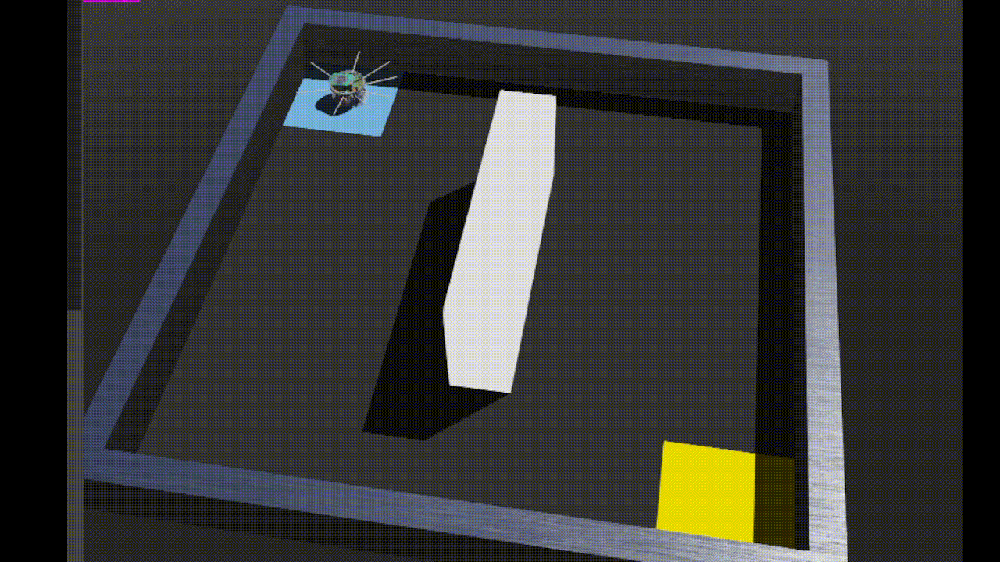

# Deep Q Network en Webots

Este proyecto consiste en la simulación de un robot E-puck en el entorno Webots, capaz de navegar un laberinto y encontrar una meta de forma autónoma. Para ello, utiliza Aprendizaje por Refuerzo Profundo (Deep Reinforcement Learning), específicamente el algoritmo Deep Q-Network (DQN).

El robot utiliza sensores infrarrojos de distancia (PS) para detectar obstáculos (definir su estado) y sensores de suelo (GS) para identificar la zona de meta. El objetivo es que el robot aprenda, a través de prueba y error, una política óptima (aproximada por una Red Neuronal Profunda) que le indique la mejor acción (avanzar, girar) a tomar en cada estado para maximizar la recompensa total.


## Tecnologías Usadas

- [Webots R2020b revision 1](https://cyberbotics.com/#download)
- Python (API oficial de Webots)
- Epuck
- Sensores infrarrojos de distancia
- Deep Q Network
- Sensores infrarrojos de distancia (PS) para detección de obstáculos.
- Sensores de suelo (GS) para detección de meta.

---

## Deep Q Network - Algoritmo

es un algoritmo que fusiona el Aprendizaje por Refuerzo (Q-Learning) con Redes Neuronales Profundas (Deep Learning).

El Q-Learning tradicional utiliza una "Tabla Q" (una matriz) para almacenar el valor (la recompensa futura esperada) de cada acción en cada estado. Esto funciona bien para problemas simples, pero se vuelve inviable cuando hay muchos estados.

En tu proyecto, el "estado" son los 8 valores de los sensores de proximidad. Como estos valores son continuos (pueden ser 0.1, 0.11, 0.112, etc.), tendrías un número infinito de estados. Es imposible crear una tabla para eso.

DQN resuelve esto usando una Red Neuronal como un "aproximador de funciones". En lugar de almacenar el valor Q, la red aprende a predecir el valor Q para cualquier estado que se le presente.

El algoritmo DQN implementado se basa en dos ideas clave:

### Replay Buffer (Memoria de Repetición)

En lugar de aprender solo de la última experiencia, el agente almacena un historial de sus transiciones (estado, acción, recompensa, estado_siguiente, done).

Para aprender, el agente toma una muestra aleatoria (batch) de esta memoria. Esto es crucial por dos razones:

- **Rompe la correlación**: Las experiencias consecutivas en un robot son muy similares. Aprender de ellas en orden es ineficiente y puede llevar a la red a "olvidar" lo aprendido en estados diferentes. El muestreo aleatorio rompe esta correlación.
- **Eficiencia de datos**: Cada experiencia se reutiliza varias veces para el entrenamiento, lo que permite al agente aprender más de lo que ha vivido.

### Target Network (Red Objetivo)

El aprendizaje en Q-Learning se basa en hacer que el valor Q actual se parezca a un "valor objetivo" (Target Q). El problema es que este "objetivo" también lo calcula la propia red neuronal. Esto es como intentar acertar a un blanco que se mueve constantemente, lo que genera mucha inestabilidad.

DQN resuelve esto usando dos redes neuronales:

- **Modelo Principal**: La red que se entrena activamente en cada paso, se usa para decidir la mejor acción (explotación).

- **Modelo Objetivo**: Es un clon del modelo principal. Esta red se usa solo para calcular el "valor objetivo" y se actualiza de forma lenta.

Esto proporciona un objetivo estable durante el entrenamiento, permitiendo que el modelo principal "alcance" al objetivo antes de que este se mueva.

### Fórmulas

El objetivo del entrenamiento es minimizar el error entre la predicción de la red principal y el "valor objetivo" (Target Q) calculado por la red objetivo.

#### 1. El Valor Q Predicho

Es simplemente la salida de la red principal. Para un estado s y una acción a, la red predice el valor Q.

$$\text{Predicción} = Q_{\text{principal}}(s, a)$$

#### 2. El Valor Q Objetivo (Target Q)

Este es el núcleo del algoritmo y se basa en la Ecuación de Bellman. El "valor objetivo" Y se calcula usando la recompensa r obtenida y el máximo valor Q posible en el siguiente estado s', según la red objetivo.

$$Y = r + \gamma \max_{a'} Q_{\text{objetivo}}(s', a')$$

- Y: El valor Q objetivo (el "Target").
- r: La recompensa inmediata recibida.
- gamma: El factor de descuento. Determina qué tan importantes son las recompensas futuras. Un valor cercano a 1 significa que el agente se preocupa mucho por el futuro.
- \max_Q(s', a'): La red objetivo predice los Q-values para todas las acciones en el siguiente estado s', y tomamos el valor máximo (la mejor acción posible desde s').

Nota: Si el estado s' es terminal, el futuro no importa, por lo que el objetivo es simplemente Y = r.

#### 3. La Función de Pérdida (Loss)

El entrenamiento consiste en minimizar la diferencia entre la predicción y el objetivo. Tu código utiliza la Pérdida de Huber.

$$\text{Loss} = \mathcal{L}(Y - Q_{\text{principal}}(s, a))$$

La Pérdida de Huber es una combinación de:

- **Error Cuadrático Medio (MSE)**: Cuando el error es pequeño, actúa como MSE (error^2), permitiendo un ajuste fino.
- **Error Absoluto Medio (MAE)**: Cuando el error es grande, actúa como MAE (|error|), lo que lo hace menos sensible a recompensas o penalizaciones muy grandes (outliers) y evita "explosiones" en los gradientes.

### Arquitectura

La arquitectura de tu red neuronal se define en la función build_model. Es una red neuronal de tipo "Perceptrón Multicapa" (MLP) totalmente conectada.

#### Capa de Entrada (Input)

- **Forma**: (input_dim,) que es 8.
- **Propósito**: Recibe el "estado" del robot. Cada una de las 8 neuronas de entrada corresponde a uno de los 8 sensores de proximidad (ps0...ps7).

### Capas Ocultas (Hidden Layers)

- **Capa Oculta 1**:
  - 64 neuronas.
  - **Activación ReLU (Rectified Linear Unit)**: Es una función de activación estándar y eficiente. Si la entrada es negativa, la salida es 0; si es positiva, la salida es la propia entrada.
- **Capa Oculta 2**:
  - 32 neuronas.
  - **Activación ReLU**.

Estas capas permiten a la red aprender patrones complejos a partir de las lecturas de los sensores (por ejemplo, "si ps0 y ps1 están altos, pero ps7 está bajo, significa que hay una pared a la izquierda").

#### Capa de Salida (Output)

- **Neuronas**: 3.
- **Propósito**: Cada neurona de salida corresponde a una de las acciones posibles:
  - Neurona 0: Q-Value para "Avanzar" (acción 0)
  - Neurona 1: Q-Value para "Girar Izquierda" (acción 1)
  - Neurona 2: Q-Value para "Girar Derecha" (acción 2)
- **Activación 'linear'**: Es crucial. A diferencia de la clasificación (que usaría 'softmax'), los valores Q no son probabilidades. Pueden ser cualquier número real (positivo o negativo), ya que representan una recompensa esperada. 'Linear' simplemente significa que no se aplica ninguna activación (y=x).

---

## Deep Q Network - Python

### 1. La Simulación del Robot `environment.py`

Este archivo define la clase `EPuckEnv`, que actúa como un puente entre el controlador de Webots y el agente de Reinforcement Learning. Abstrae las acciones y sensores del robot.

#### `__init__(self, robot, time_step)` (Constructor)

Inicializa la conexión con el robot en Webots, obtiene los dispositivos (motores y sensores) y los activa.

- `self.robot = robot`: Almacena la referencia al objeto `Supervisor` de Webots.
- `self.left_motor = ...` y `self.right_motor = ...`: Obtiene los punteros a los motores de las ruedas.
- `setPosition(float('inf'))`: Configura los motores en modo de rotación continua (control por velocidad).
- `setVelocity(0.0)`: Asegura que el robot comience detenido.
- `getDistanceSensor(...)` y `enable(self.TIME_STEP)`: Obtiene los 8 sensores de proximidad (ps) y los 3 de suelo (gs) y los activa.

```python
    def __init__(self, robot, time_step):
        self.robot = robot
        self.TIME_STEP = time_step
        self.MAX_SPEED = 6.28
        self.END_MIN = 200
        self.END_MAX = 300

        self.left_motor = robot.getMotor('left wheel motor')
        self.right_motor = robot.getMotor('right wheel motor')
        self.left_motor.setPosition(float('inf'))
        self.right_motor.setPosition(float('inf'))
        self.left_motor.setVelocity(0.0)
        self.right_motor.setVelocity(0.0)

        self.ps = []
        ps_names = ['ps0', 'ps1', 'ps2', 'ps3', 'ps4', 'ps5', 'ps6', 'ps7']
        for name in ps_names:
            sensor = robot.getDistanceSensor(name)
            sensor.enable(self.TIME_STEP)
            self.ps.append(sensor)

        self.gs = []
        gs_names = ['gs0', 'gs1', 'gs2']
        for name in gs_names:
            sensor = robot.getDistanceSensor(name)
            sensor.enable(self.TIME_STEP)
            self.gs.append(sensor)
        print("Clase EPuckEnv inicializada con motores y sensores.")
```

#### `get_state(self)`

Define el "estado" del robot, que es la entrada para la red neuronal.

- `ps_values = [s.getValue() for s in self.ps]`: Lee los 8 valores de los sensores de proximidad.
- `state = np.array(ps_values) / 1000.0`: Convierte los valores a un array y los normaliza (divide por 1000.0) para que la red neuronal trabaje con números más pequeños.

```python
    def get_state(self):
        ps_values = [s.getValue() for s in self.ps]
        state = np.array(ps_values) / 1000.0
        return state
```

#### `apply_action(self, action)`

Traduce una acción discreta (0, 1, o 2) en velocidades para los motores.

- `action == 0`: **Avanzar**. Ambos motores van a máxima velocidad.
- `action == 1`: **Girar Izquierda**. El motor izquierdo va hacia atrás y el derecho hacia adelante.
- `action == 2`: **Girar Derecha**. El motor izquierdo va hacia adelante y el derecho hacia atrás.

```python
    def apply_action(self, action):
        turn_speed = self.MAX_SPEED * 0.8
        if action == 0:
            left_speed = self.MAX_SPEED
            right_speed = self.MAX_SPEED
        elif action == 1:
            left_speed = -turn_speed
            right_speed = turn_speed
        else:
            left_speed = turn_speed
            right_speed = -turn_speed
        self.left_motor.setVelocity(left_speed)
        self.right_motor.setVelocity(right_speed)
```

#### `get_reward_and_done(self, action, state_values)`

Calcula la recompensa por la acción tomada y determina si el episodio ha terminado.

- `floor_values = [s.getValue() for s in self.gs]`: Lee los sensores de suelo.
- `if (self.END_MIN <= ...)`: Comprueba si los 3 sensores de suelo están sobre la zona de meta. Si es así, da una **recompensa alta (1.0)** y termina el episodio (`done = True`).
- `front_obstacle = ...`: Comprueba si los sensores frontales (ps0 y ps7) detectan un obstáculo. Si es así, da una **penalización alta (-1.0)**.
- `elif action == 0`: Si no choca y la acción fue "avanzar", da una **pequeña recompensa (0.1)** para incentivar el movimiento.
- `else`: Si la acción fue "girar" (y no hay choque/meta), da una **pequeña penalización (-0.1)** para desincentivar giros innecesarios.

```python
    def get_reward_and_done(self, action, state_values):
        reward = 0.0
        done = False
        floor_values = [s.getValue() for s in self.gs]

        if (self.END_MIN <= floor_values[0] <= self.END_MAX and
            self.END_MIN <= floor_values[1] <= self.END_MAX and
            self.END_MIN <= floor_values[2] <= self.END_MAX):
            reward = 1.0
            done = True
        else:
            front_obstacle_threshold = 0.1
            front_obstacle = (state_values[0] > front_obstacle_threshold or
                              state_values[7] > front_obstacle_threshold)
            if front_obstacle:
                reward = -1.0
            elif action == 0:
                reward = 0.1
            else:
                reward = -0.1
        return reward, done
```

---

### 2. El Cerebro DQN `agent.py`

Este archivo define al agente de DQN. Contiene la arquitectura de la red neuronal, el buffer de repetición y la lógica de aprendizaje.

#### `build_model(input_dim, output_dim)` (Función Helper)

Define la arquitectura de la Red Neuronal Profunda (DQN) usando Keras.

- `input_dim`: Dimensión del estado (8, por los 8 sensores).
- `output_dim`: Dimensión de la acción (3, por Avanzar, Izquierda, Derecha).
- `layers.Dense(64, ...)` y `layers.Dense(32, ...)`: Capas ocultas con activación ReLU.
- `layers.Dense(output_dim, activation='linear')`: Capa de salida. Produce 3 valores Q (uno por acción) sin activación (lineal), ya que los valores Q no están acotados.
- `model.compile(...)`: Configura el optimizador `Adam` y la función de pérdida `huber`, que es robusta frente a errores grandes.

```python
def build_model(input_dim, output_dim):
    model = keras.Sequential([
        layers.Dense(64, activation='relu', input_shape=(input_dim,)),
        layers.Dense(32, activation='relu'),
        layers.Dense(output_dim, activation='linear')
    ])
    model.compile(optimizer=keras.optimizers.Adam(learning_rate=0.0001, clipvalue=1.0), loss='huber')
    return model
```

#### `ReplayBuffer` (Clase)

Almacena las experiencias pasadas `(estado, acción, recompensa, estado_siguiente, done)` para que el agente pueda aprender de ellas en lotes aleatorios.

- `self.buffer = deque(maxlen=...)`: Usa una `deque` (cola de doble extremo) que descarta automáticamente las experiencias más antiguas cuando se llena.
- `add(...)`: Añade una nueva experiencia al buffer.
- `sample(...)`: Extrae un lote (`batch_size`) de experiencias aleatorias del buffer.

```python
class ReplayBuffer:
    def __init__(self, max_size=20000):
        self.buffer = deque(maxlen=max_size)

    def add(self, state, action, reward, next_state, done):
        self.buffer.append((state, action, reward, next_state, done))

    def sample(self, batch_size):
        return random.sample(self.buffer, batch_size)

    def __len__(self):
        return len(self.buffer)
```

#### `DQNAgent.__init__(self, state_dim, action_dim)` (Constructor)

Inicializa el agente, sus hiperparámetros y sus dos redes neuronales (la principal y la "target").

- `self.gamma`: Factor de descuento (qué tanto importan las recompensas futuras).
- `self.epsilon`: Tasa de exploración (probabilidad de tomar una acción aleatoria).
- `self.epsilon_decay` y `self.epsilon_min`: Controlan cómo `epsilon` disminuye con el tiempo.
- `self.buffer = ReplayBuffer()`: Crea la memoria del agente.
- `self.model = build_model(...)`: Crea la red neuronal principal (la que aprende).
- `self.target_model = build_model(...)`: Crea la red "objetivo" (target network), una copia que se actualiza lentamente para estabilizar el aprendizaje.
- `self.update_target_model()`: Sincroniza ambas redes al inicio.

```python
class DQNAgent:
    def __init__(self, state_dim, action_dim):
        self.state_dim = state_dim
        self.action_dim = action_dim
        self.gamma = 0.95
        self.epsilon = 1.0
        self.epsilon_decay = 0.995
        self.epsilon_min = 0.01
        self.batch_size = 32
        self.buffer = ReplayBuffer()
        self.model = build_model(state_dim, action_dim)
        self.target_model = build_model(state_dim, action_dim)
        self.update_target_model()
        self.model_weights_file = 'dqn_model_weights.h5'
        self.epsilon_file = 'dqn_epsilon.npy'
        self.buffer_file = 'dqn_buffer.pkl'
```

#### `choose_action(self, state)`

Decide qué acción tomar usando la política "Epsilon-Greedy".

- `if np.random.rand() < self.epsilon`: Si un número aleatorio es menor que epsilon, elige una **acción aleatoria** (exploración).
- `else`: Si no, usa la red neuronal (`self.model`) para predecir los valores Q para el estado actual y elige la **mejor acción** (la que tiene el valor Q más alto, `np.argmax`).

```python
    def choose_action(self, state):
        if np.random.rand() < self.epsilon:
            return random.randrange(self.action_dim)
        state_tensor = state[np.newaxis, :]
        q_values = self.model.predict(state_tensor, verbose=0)
        return np.argmax(q_values[0])
```

#### `learn(self)`

El núcleo del aprendizaje (actualización de la red neuronal).

1.  `if len(self.buffer) < self.batch_size`: No aprende si el buffer no tiene suficientes muestras.
2.  `batch = self.buffer.sample(...)`: Toma un lote de experiencias pasadas.
3.  `q_next = self.target_model.predict(...)`: Usa la red **target** (la estable) para predecir el valor Q máximo del _siguiente_ estado.
4.  `targets = rewards + self.gamma * q_next_max * (1 - dones)`: Calcula el valor Q "objetivo" (Target Q) usando la ecuación de Bellman. Si el episodio terminó (`dones=True`), el objetivo es solo la recompensa.
5.  `q_current = self.model.predict(...)`: Obtiene las predicciones actuales de la red **principal**.
6.  `q_current[i, actions[i]] = targets[i]`: Modifica los valores Q actuales: solo actualiza el valor Q de la acción que _realmente se tomó_ con el "target" calculado. Los Q de las otras acciones se dejan como estaban.
7.  `self.model.fit(states, q_current, ...)`: Entrena la red **principal** para que sus salidas (`q_current` predichos) se parezcan más a los `targets` calculados.

```python
    def learn(self):
        if len(self.buffer) < self.batch_size:
            return None
        batch = self.buffer.sample(self.batch_size)
        states, actions, rewards, next_states, dones = zip(*batch)
        states = np.array(states)
        actions = np.array(actions)
        rewards = np.array(rewards)
        next_states = np.array(next_states)
        dones = np.array(dones)

        # 1. Calcular el valor Q máximo del siguiente estado usando la RED TARGET
        q_next = self.target_model.predict(next_states, verbose=0)
        q_next_max = np.max(q_next, axis=1)

        # 2. Calcular el Q-Target (Ecuación de Bellman)
        targets = rewards + self.gamma * q_next_max * (1 - dones)

        # 3. Obtener los Q actuales de la RED PRINCIPAL
        q_current = self.model.predict(states, verbose=0)

        # 4. Actualizar solo el Q-valor de la acción tomada
        for i in range(self.batch_size):
            q_current[i, actions[i]] = targets[i]

        # 5. Entrenar la RED PRINCIPAL
        history = self.model.fit(states, q_current, epochs=1, verbose=0)
        loss = history.history['loss'][0]
        return loss
```

#### `save_state(self)` y `load_state(self)`

Funciones para guardar y cargar el progreso del entrenamiento.

- Guardan/cargan los pesos de la red (`.h5`), el valor actual de epsilon (`.npy`) y el buffer de repetición (`.pkl`), permitiendo reanudar el entrenamiento.

```python
    def save_state(self):
        print(f"Guardando estado... Epsilon actual: {self.epsilon}")
        self.model.save_weights(self.model_weights_file)
        np.save(self.epsilon_file, [self.epsilon])
        try:
            with open(self.buffer_file, 'wb') as f:
                pickle.dump(self.buffer, f)
            print(f"Buffer guardado (Tamaño: {len(self.buffer)})")
        except Exception as e:
            print(f"Error al guardar el buffer: {e}")

    def load_state(self):
        if os.path.exists(self.model_weights_file):
            print("Cargando estado guardado...")
            self.model.load_weights(self.model_weights_file)
            self.epsilon = np.load(self.epsilon_file)[0]
            print(f"Estado cargado. Epsilon reanudado en: {self.epsilon}")
            self.update_target_model()
        else:
            print("No se encontró estado guardado. Empezando de cero.")
        if os.path.exists(self.buffer_file):
            try:
                with open(self.buffer_file, 'rb') as f:
                    self.buffer = pickle.load(f)
                print(f"Buffer cargado (Tamaño: {len(self.buffer)})")
            except Exception as e:
                print(f"Error al cargar el buffer: {e}")
```

---

### 3. El Controlador de Entrenamiento `dqn.py`

Este es el script principal que se ejecuta en Webots para entrenar al agente.

#### Inicialización y Carga de "Mejor Modelo"

Configura el entorno y el agente. También carga las métricas del mejor modelo guardado anteriormente para saber si el agente supera su propio récord.

- `supervisor = Supervisor()`: Obtiene el controlador de Webots.
- `env = EPuckEnv(...)` y `agent = DQNAgent(...)`: Crea los objetos del entorno y el agente.
- `if os.path.exists(BEST_METRICS_FILE): ...`: Comprueba si existe un récord anterior (`.npy`) y carga los mejores pasos, recompensa y pérdida (`BEST_STEPS`, `BEST_REWARD`, `BEST_AVG_LOSS`).

```python
supervisor = Supervisor()
TIME_STEP = 64
MAX_STEPS_PER_EPISODE = 1000
UPDATE_TARGET_EVERY = 100
STATE_DIM = 8
ACTION_DIM = 3

env = EPuckEnv(supervisor, TIME_STEP)
agent = DQNAgent(STATE_DIM, ACTION_DIM)

BEST_MODEL_FILE = 'dqn_best_model.h5'
BEST_METRICS_FILE = 'dqn_best_metrics.npy'

if os.path.exists(BEST_METRICS_FILE):
    print("Cargando métricas del mejor modelo...")
    metrics = np.load(BEST_METRICS_FILE)
    BEST_STEPS = metrics[0]
    BEST_REWARD = metrics[1]
    BEST_AVG_LOSS = metrics[2]
else:
    print("No se encontraron métricas. Empezando 'Mejor Modelo' de cero.")
    BEST_STEPS = np.inf
    BEST_REWARD = -np.inf
    BEST_AVG_LOSS = np.inf
```

#### Bucle Principal de Simulación (`while supervisor.step(...) != -1:`)

Este es el bucle que se ejecuta en cada paso de la simulación.

- `action = agent.choose_action(state)`: Elige una acción (Exploración o Explotación).
- `env.apply_action(action)`: Ejecuta la acción en el robot.
- `next_state = env.get_state()`: Observa el nuevo estado (lectura de sensores).
- `reward, done = env.get_reward_and_done(...)`: Obtiene la recompensa y si el episodio terminó.
- `agent.store_transition(...)`: Guarda la experiencia en el Replay Buffer.
- `loss = agent.learn()`: Ejecuta un paso de aprendizaje (si el buffer está listo).
- `agent.update_target_model()`: Cada `UPDATE_TARGET_EVERY` pasos, actualiza la red "target".

```python
agent.load_state()
print(f"--- Iniciando Episodio (Epsilon actual: {agent.epsilon:.3f}) ---")
state = env.get_state()

while supervisor.step(TIME_STEP) != -1:
    action = agent.choose_action(state)
    env.apply_action(action)
    next_state = env.get_state()
    reward, done = env.get_reward_and_done(action, state)
    total_reward += reward

    agent.store_transition(state, action, reward, next_state, done)
    loss = agent.learn()

    if loss is not None:
        episode_losses.append(loss)

    state = next_state
    step_counter += 1

    if step_counter % UPDATE_TARGET_EVERY == 0:
        agent.update_target_model()

    if done or step_counter > MAX_STEPS_PER_EPISODE:
```

#### Fin del Episodio (Logging y Guardado)

Esta sección se ejecuta cuando el robot llega a la meta (`done=True`) o se acaba el tiempo (`MAX_STEPS_PER_EPISODE`).

- Calcula la duración y la pérdida (loss) promedio del episodio.
- Escribe los resultados en los archivos de log (`LOG_FILE`, `METRICS_LOG_FILE`).
- `agent.decay_epsilon()`: Reduce epsilon para el próximo episodio.
- `agent.save_state()`: Guarda el progreso actual (para poder reanudar).
- **Lógica del "Mejor Modelo"**:
  - Comprueba si el episodio fue exitoso (`reason == "Meta"`) y si superó el récord anterior (menos pasos, o igual pasos con más recompensa, o igual todo con menos loss).
  - Si es un nuevo récord, guarda los pesos del modelo en `BEST_MODEL_FILE` (`dqn_best_model.h5`) y actualiza las métricas en `BEST_METRICS_FILE`.
- `supervisor.worldReload()`: Reinicia la simulación para el próximo episodio.
- `if agent.epsilon <= agent.epsilon_min: break`: Si epsilon llega a su mínimo, el entrenamiento termina.

```python
    if done or step_counter > MAX_STEPS_PER_EPISODE:
        try:
            avg_loss = np.mean(episode_losses) if episode_losses else 0
        except Exception as e:
            print(f"Error al escribir en el log: {e}")

        agent.decay_epsilon()
        agent.save_state()
        if (reason == "Meta" and
            (step_counter < BEST_STEPS or
             (step_counter == BEST_STEPS and total_reward > BEST_REWARD) or
             (step_counter == BEST_STEPS and total_reward == BEST_REWARD and avg_loss < BEST_AVG_LOSS))):

            print("\n--- ¡NUEVO MEJOR MODELO ENCONTRADO! ---")
            BEST_STEPS = step_counter
            BEST_REWARD = total_reward
            BEST_AVG_LOSS = avg_loss
            agent.model.save_weights(BEST_MODEL_FILE)
            metrics_to_save = np.array([BEST_STEPS, BEST_REWARD, BEST_AVG_LOSS])
            np.save(BEST_METRICS_FILE, metrics_to_save)
        else:
            print("Info: No es un nuevo 'Mejor Modelo'.")
        if agent.epsilon <= agent.epsilon_min:
            print("--- ENTRENAMIENTO COMPLETADO (Epsilon Mínimo alcanzado) ---")
            break
        else:
            print("--- Reiniciando para el próximo episodio... ---")
            supervisor.worldReload()
            supervisor.step(TIME_STEP)
```

---

### 4. El Controlador de Evaluación `eval.py`

Este script se usa _después_ del entrenamiento para ver al agente en acción. Carga el **mejor modelo** guardado y lo ejecuta sin exploración.

#### Inicialización y Carga del Mejor Modelo

Configura el entorno y el agente, pero en lugar de cargar el último estado, carga el `dqn_best_model.h5`.

- `if os.path.exists(BEST_MODEL_FILE): ...`: Comprueba que el modelo entrenado exista.
- `agent.model.load_weights(BEST_MODEL_FILE)`: Carga los pesos del mejor modelo encontrado durante el entrenamiento.
- `agent.epsilon = 0.0`: **¡Muy importante\!** Fija epsilon a 0.0. Esto desactiva la exploración (acciones aleatorias). El agente siempre elegirá la mejor acción que conoce (modo "Greedy").

```python
TIME_STEP = 64
MAX_STEPS_PER_EPISODE = 1000
STATE_DIM = 8
ACTION_DIM = 3

BEST_MODEL_FILE = 'dqn_best_model.h5'

supervisor = Supervisor()
env = EPuckEnv(supervisor, TIME_STEP)
agent = DQNAgent(STATE_DIM, ACTION_DIM)

if os.path.exists(BEST_MODEL_FILE):
    print("--- MODO EVALUACIÓN ---")
    print(f"Cargando el MEJOR modelo desde: {BEST_MODEL_FILE}")
    agent.model.load_weights(BEST_MODEL_FILE)
    agent.epsilon = 0.0
    print("Epsilon fijado en 0.0 (Modo 'Greedy'). No hay aleatoriedad.")
else:
    print(f"Error: No se encontró el archivo del mejor modelo: {BEST_MODEL_FILE}")
    sys.exit()
```

#### Bucle de Evaluación y Reinicio

Ejecuta la simulación de forma similar al entrenamiento, pero con diferencias clave.

- `action = agent.choose_action(state)`: Siempre elegirá la mejor acción (epsilon=0).
- **No hay aprendizaje**: Faltan las llamadas a `agent.store_transition()`, `agent.learn()` y `agent.decay_epsilon()`. El agente solo actúa, no aprende.
- `if done or step_counter > ...`: Cuando el episodio termina (llega a la meta o falla), imprime el resultado.
- `supervisor.worldReload()`: Reinicia el mundo inmediatamente para repetir la demostración óptima.

```python
supervisor.step(TIME_STEP)
state = env.get_state()
total_reward = 0
step_counter = 0
while supervisor.step(TIME_STEP) != -1:
    action = agent.choose_action(state)
    env.apply_action(action)
    next_state = env.get_state()
    reward, done = env.get_reward_and_done(action, state)
    total_reward += reward
    state = next_state
    step_counter += 1

    if done or step_counter > MAX_STEPS_PER_EPISODE:
        if done:
            print(f"¡META ALCANZADA! Pasos: {step_counter}, Recompensa Final: {total_reward:.2f}")
        else:
             print(f"¡TIEMPO LÍMITE! Pasos: {step_counter}, Recompensa Final: {total_reward:.2f}")

        print("--- Reiniciando mundo para repetir la demostración ---")
        supervisor.worldReload()
        supervisor.step(TIME_STEP)
        state = env.get_state()
        total_reward = 0
        step_counter = 0
```

---

## Resultados

El entrenamiento evidenció de manera clara la progresión del agente DQN desde un estado inicial de desconocimiento total hasta el desarrollo de una política capaz de resolver exitosamente el laberinto. Este proceso pudo dividirse en tres fases principales.

### 1. Fase de Exploración Pura (Episodios ~1–90)

- **Comportamiento:** En esta etapa inicial, el valor de _Epsilon_ fue elevado (iniciando en 1.0), lo que implicó que el agente ejecutara acciones casi completamente aleatorias.
- **Resultados:** La mayoría de los episodios concluyeron en _fracaso_, alcanzando el límite máximo de 1001 pasos. Las recompensas obtenidas fueron altamente negativas (por ejemplo, –602.80, –618.40, –946.60), ya que el robot colisionaba repetidamente o realizaba acciones ineficientes.
- **Primer éxito:** En el episodio 5, el agente alcanzó la _Meta_ por azar, tras 797 pasos, manteniendo aún una recompensa negativa (–381.20).
- **Pérdida (_Loss_):** Tal como se observó en el gráfico correspondiente, el valor promedio de pérdida (_Avg Loss_) inició bajo y aumentó durante esta fase. Al comienzo, la red no poseía conocimiento alguno, por lo que su error era reducido; sin embargo, conforme exploraba y recibía recompensas (mayoritariamente negativas), sus predicciones se tornaron incorrectas, incrementando así el error total.

### 2. Fase de Aprendizaje y Explotación (Episodios ~90–300)

- **Comportamiento:** En esta fase, _Epsilon_ disminuyó progresivamente (aproximadamente entre 0.6 y 0.2), lo que permitió al agente comenzar a explotar lo aprendido, combinando la exploración con decisiones más informadas.
- **Resultados:** Se observó un incremento notable en los episodios exitosos (_Meta_).
- En el **episodio 100** (_Epsilon_ = 0.5878), el agente resolvió el laberinto en 191 pasos, evidenciando un aprendizaje significativo.
- En el **episodio 170** (_Epsilon_ = 0.4395), alcanzó su primera recompensa positiva (29.00), lo que indicó que las recompensas por avanzar superaron las penalizaciones por colisión o giros innecesarios.
- Los gráficos reflejaron claramente esta evolución: la _Recompensa Total_ mostró una tendencia ascendente, abandonando los valores negativos extremos, mientras que la _Pérdida Promedio_ alcanzó su punto máximo y luego comenzó a estabilizarse, reflejando predicciones más precisas por parte de la red neuronal.

### 3. Fase de Convergencia (Episodios ~300 en adelante)

- **Comportamiento:** En esta etapa final, _Epsilon_ se mantuvo bajo (menor a 0.2), por lo que el agente actuó principalmente de manera _greedy_, seleccionando las acciones que consideraba óptimas.
- **Resultados:** El agente resolvió el laberinto de forma consistente, reduciéndose considerablemente los episodios de _fracaso_.
- En el **episodio 275**, alcanzó la recompensa positiva más alta (35.30).
- En el **episodio 373**, logró su mejor tiempo (190 pasos).
- Finalmente, el **entrenamiento concluyó en el episodio 470** (_Epsilon_ = 0.0897), alcanzando la _Meta_ en 210 pasos con una recompensa de 17.70, consolidando un desempeño estable.
- La media móvil de la recompensa se estabilizó en valores positivos, mientras que la media móvil de la pérdida descendió y permaneció en niveles bajos, evidenciando la convergencia del modelo y la estabilidad de sus predicciones.

| Episodio | Epsilon | Pasos | Resultado | Recompensa Total | Hito Significativo                           |
| -------- | ------- | ----- | --------- | ---------------- | -------------------------------------------- |
| 1        | 1.0000  | 1001  | Fracaso   | -602.80          | Inicio del entrenamiento (exploración pura)  |
| 5        | 0.9801  | 797   | Meta      | -381.20          | Primera vez que alcanza la "Meta" (por azar) |
| 100      | 0.5878  | 191   | Meta      | -105.50          | Primer éxito rápido (aprendizaje evidente)   |
| 170      | 0.4395  | 633   | Meta      | 29.00            | Primera recompensa positiva                  |
| 275      | 0.1865  | 887   | Meta      | 35.30            | Recompensa positiva más alta                 |
| 373      | 0.1243  | 190   | Meta      | 16.50            | Episodio más rápido (menor número de pasos)  |
| 470      | 0.0897  | 210   | Meta      | 17.70            | Último episodio (éxito consistente)          |

### Gráficos

1. **Recompensa total por episodio**
   Se representó la recompensa acumulada al final de cada episodio. La línea roja (media móvil) mostró la tendencia general, evidenciando el tránsito desde recompensas muy negativas hacia valores positivos y estables conforme el agente aprendía.

   

2. **Pérdida (_Loss_) promedio por episodio**
   Se ilustró el error promedio de la red neuronal por episodio. La línea azul (media móvil) mostró la evolución del error: éste aumentó durante la fase de exploración inicial y posteriormente disminuyó hasta estabilizarse, reflejando la convergencia del modelo y la precisión de sus predicciones.

   



## Ejecución del Proyecto en Webots

Para ejecutar este proyecto en **Webots**, sigue estos pasos:

1. **Clona el repositorio** en tu computadora:

   ```bash
   git clone https://github.com/ShinjiMC/webots-deep-q-network.git
   ```

2. **Abre Webots** y selecciona:

   ```
   File → Open World...
   ```

   Luego, navega hasta la carpeta del proyecto y abre el archivo:

   ```
   worlds/empty.wbt
   ```

3. **Verifica el controlador**:

   - Asegúrate de que el robot tenga asignado el controlador `dqn` (en Python).
   - Si no, selecciónalo desde el panel izquierdo en **Robot → Controller**.

4. **Ejecuta el entrenamiento**:

   - Haz clic en el botón **Play** o presiona **Ctrl + T** para iniciar la simulación.
   - El robot comenzará a entrenar el modelo desde cero, generando el archivo de pesos entrenados en formato `.h5`.

5. **Evaluar el modelo entrenado**

   Para evaluar el modelo entrenado y observar el comportamiento final del agente:

   - Cambia el nombre del archivo `dqn.py` a `dqn_2.py` (esto evita conflictos con el nuevo script de evaluación).
   - Verifica el nombre exacto del archivo `.h5` generado durante el entrenamiento (por ejemplo, `model_dqn_final.h5`).
   - Abre el archivo `eval.py`, reemplaza el nombre del modelo en el código por el nombre correcto del archivo `.h5`, y cambia el nombre del script de `eval.py` a `dqn.py`.
   - Finalmente, ejecuta nuevamente la simulación. El robot utilizará el modelo entrenado y llegará consistentemente a la meta sin requerir aprendizaje adicional.

---

## Author

- **Braulio Maldonado Casilla** - [GitHub Profile](https://github.com/ShinjiMC)

## License

This project is licensed under the MIT License. See the [LICENSE](LICENSE) file for details.
